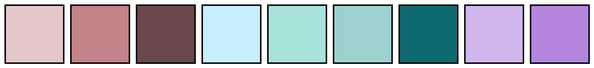
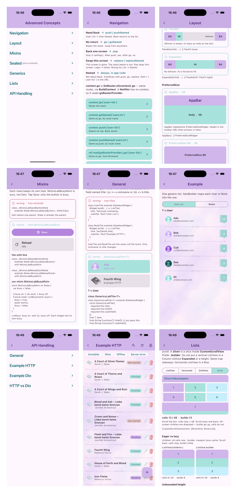

<a name="readme-top"></a>

<!-- Top Links Bar -->

<a href="#test-coverage"></a>

[](https://www.linkedin.com/in/tanja-polz-5636401a5/)
[](https://twitter.com/_foxnoir_?lang=de)
[](https://www.instagram.com/codeincouture/)

<!-- PROJECT LOGO -->
<br />

<div align="center">
  
  <h1 align="center">Advanced Concepts</h1>
  <p>
     Practice project covering, among other things, layout, mixins, sealed classes, and generics.
  </p>
</div>

---

<div align="left">

[](https://flutter.dev/)
[](https://dart.dev/)
[](https://pub.dev/packages/flutter_riverpod)
[](https://pub.dev/packages/riverpod_lint)
[](https://pub.dev/packages/go_router)
[](https://docs.flutter.dev/ui/internationalization)
[](https://pub.dev/packages/intl)
[](https://pub.dev/packages/very_good_analysis)
[](https://fvm.app)
[](https://developer.apple.com/ios/)
[](https://docs.flutter.dev/platform-integration/web)
[](https://firebase.google.com/)

</div>

<details>
  <summary>Table of Contents</summary>
  <ol>
    <li><a href="#about">About</a></li>
    <li>
      <a href="#style-guide">Style Guide</a>
      <ul>
        <li><a href="#color-palette">Color Palette</a></li>
      </ul>
    </li>
    <li>
      <a href="#gorouter">GoRouter</a>
      <ul>
        <li><a href="#go-vs-push">go vs push</a></li>
        <li><a href="#pop-vs-replace">pop vs replace</a></li>
        <li><a href="#named-vs-path">Named vs path</a></li>
        <li><a href="#buildcontext">BuildContext</a></li>
      </ul>
    </li>
    <li>
      <a href="#layout">Layout</a>
      <ul>
        <li><a href="#flexible-vs-expanded">Flexible vs Expanded</a></li>
        <li><a href="#preferredsize">PreferredSize</a></li>
        <li><a href="#layoutbuilder-vs-mediaquery">LayoutBuilder vs MediaQuery</a></li>
        <li><a href="#breakpoints">Breakpoints</a></li>
      </ul>
    </li>
    <li>
      <a href="#mixins">Mixins</a>
      <ul>
        <li><a href="#mixin-vs-extends">mixin vs extends</a></li>
      </ul>
    </li>
    <li>
      <a href="#sealed-plus-extends">Sealed (plus extends)</a>
    </li>
    <li>
      <a href="#generics">Generics</a>
      <ul>
        <li><a href="#t-is-a-type-blank">T is a type blank</a></li>
        <li><a href="#genericslabtile-t">GenericsLabTile T</a></li>
        <li><a href="#example-list">Example list</a></li>
      </ul>
    </li>
    <li>
      <a href="#lists">Lists</a>
      <ul>
        <li><a href="#listview-vs-gridview-vs-slivers">ListView vs GridView vs slivers</a></li>
        <li><a href="#when-to-use-which">When to use which</a></li>
        <li><a href="#problems">Problems</a></li>
      </ul>
    </li>
    <li>
      <a href="#api-integration">API integration</a>
      <ul>
        <li><a href="#unified-api-class">Unified API class</a></li>
        <li><a href="#timeouts">Timeouts</a></li>
        <li><a href="#network-errors">Network errors</a></li>
        <li><a href="#http-vs-dio">HTTP vs Dio</a></li>
        <li><a href="#loading-error-data">Loading, error, data</a></li>
        <li><a href="#authorized-vs-not-lab-only">Authorized vs not (lab only)</a></li>
      </ul>
    </li>
    <li><a href="#getting-started">Getting Started</a></li>
    <li>
      <a href="#testing">Testing</a>
      <ul>
        <li><a href="#test-coverage">Test coverage</a></li>
      </ul>
    </li>
    <li><a href="#changelog">Changelog</a></li>
    <li><a href="#sources">Sources</a></li>
  </ol>
</details>

---

## About

This project is the **navigation**, **layout**, **mixins**, **sealed classes**, **generics**, **lists**, and **API integration** practice project in [Noir's Flutter Playground](../README.md).

The **Landing Screen** is a list of labs. **Navigation** opens the Routing Lab (`RoutingLabScreen`; AppBar **Navigation**). **Layout** opens the Layout Lab (`LayoutLabScreen`): **Flexible** vs **Expanded**, **PreferredSize**, **LayoutBuilder** vs **MediaQuery**, and **Breakpoints**. **Mixins** opens the Mixins Lab (`MixinsLabScreen`): illegal two-`extends` vs `with MixinsLabBusyMixin`; Save is a button, Reload is a card; tap one, only that widget is busy. **Sealed (plus extends)** opens the Sealed Lab (`SealedLabScreen`): Fourth Wing as Hardcover / Paperback / Ebook — formats that extend `BookMetadata` (title, author), not an API subclass. **Generics** opens a hub (`GenericsLabScreen`), tiles **General** then **Example**. **General** (`GenericsGeneralLabScreen`) is two copied tiles vs `class GenericsLabTile<T>` — Ada from User List, Fourth Wing from Example HTTP. **Example** (`GenericsExampleLabScreen`) is one shelf list switched between User List and Books. **Lists** opens the Lists Lab (`ListsLabScreen`): ListView, GridView, and slivers, plus eager vs lazy build counts and the usual layout traps. **API Handling** opens a hub (`ApiHandlingScreen`), tiles in this order: **General**, **Example HTTP**, **Example Dio**, **HTTP vs Dio** last. **General** (`ApiGeneralLabScreen`) is concepts only: **CRUD**, **interceptors** vs `package:http`, and a unified API class — no live buttons. **Example HTTP** (`ApiHttpLabScreen`) and **Example Dio** (`ApiDioLabScreen`) are the same bookshelf twice — GET /books, scenario chips (including every-third-fail **Unstable**), Search, add / edit / delete. The list slot is one `when` (loading / error / data): refresh and every chip go through `load()`, so a spinner **replaces** the list — not an overlay. Tapping a book opens a placeholder details page (`BookDetailsScreen`) with the title and the reading dragon. Edit stays the sheet. Delete stays the confirm dialog, then `DELETE /books/:id`; 401 opens the login warning (see [Authorized vs not](#authorized-vs-not-lab-only)). The two features are **copied on purpose** so each lab stays a complete `package:http` or Dio stack. Sharing the shelf widgets would mix the clients; that is not best practice in a real app, and not the point here. Both labs' data layers talk to the same **Firebase** Cloud Functions + Firestore backend of romantasy **books** (`package:http` / `ApiClient` vs **Dio** / `DioApiClient`). Two stacks in one project is the lesson, not a production pattern — ship **http** or **dio**, never both. **HTTP vs Dio** (`ApiCompareLabScreen`) is a debugger: GET, DELETE, Unstable, Slow, Offline, Server error; HTTP on top, Dio below; **Next** steps `_send` vs interceptors until the request fires — still no live call. POST / PUT chips are not in this lab yet. The Routing Lab has short rules for **go**, **push**, **pop**, **replace**, **Named**, and **BuildContext**, then the exact Dart calls to **User List**. A banner prints the call after the tap (under the AppBar). User List draws the **stack** (that frame is still **Routing Lab**), offers **pop** (no-op after **go**), and `pushNamed`s every row into **User Details**. **Go to Landing Screen** always `goNamed('landing')`, so `go` never traps you.

Screens are `LandingScreen`, `RoutingLabScreen`, `LayoutLabScreen`, `MixinsLabScreen`, `SealedLabScreen`, `GenericsLabScreen`, `GenericsGeneralLabScreen`, `GenericsExampleLabScreen`, `ListsLabScreen`, `ApiHandlingScreen`, `ApiGeneralLabScreen`, `ApiHttpLabScreen`, `ApiDioLabScreen`, `ApiCompareLabScreen`, `BookDetailsScreen`, `UserListScreen`, `UserDetailsScreen`, `NotFoundScreen`. Book Details is its own feature (`lib/features/book_details/`), like User Details — both labs `pushNamed` into it. User List data is `InMemoryUserListDataSource` → `InMemoryUserListRepository`. Sealed Lab: `InMemorySealedLabDataSource` → `InMemorySealedLabRepository`. HTTP books: Firebase emulator → `package:http` → `ApiClient` → `HttpApiHttpLabDataSource` → `HttpApiHttpLabRepository`. Dio books: same emulator → `Dio` → `DioApiClient` → `DioApiDioLabDataSource` → `DioApiDioLabRepository`. Layers match [Riverpod Basics](../README.md#app-architecture-and-folder-structure).

[](https://developer.apple.com/ios/)
[](https://docs.flutter.dev/platform-integration/web)

Runs on **iOS** (Simulator: **iPhone 17 Pro**, iOS 26.5) and **web**. Layout is **mobile first** everywhere: compact is the default, then `AppBreakpoint.mediumMin` (600). Do not branch on `kIsWeb`. There is no AdaptiveScaffold — breakpoints are the `AppBreakpoint` enum.

<p align="right"><a href="#readme-top">back to top</a></p>

---

## Style Guide

<p align="right"><a href="#readme-top">back to top</a></p>

### Color Palette



<p align="right"><a href="#readme-top">back to top</a></p>

---

## Example Screens



<p align="right"><a href="#readme-top">back to top</a></p>

---

## GoRouter

**GoRouter** is Navigator 2.0: URLs, route names, one `GoRouter` in a Riverpod `Provider` (`lib/core/router/app_router.dart`). The tiles call those APIs so the stack is visible.

| | Path `'/user-list'` | Name `'userList'` |
| --- | --- | --- |
| Wipe the stack | `go` | `goNamed` |
| Stack on top | `push` | `pushNamed` |
| Swap this screen | `replace` | `replaceNamed` |
| Back one screen | `pop` | `pop` |

<p align="right"><a href="#readme-top">back to top</a></p>

### go vs push

Need **Back**? Use **push** (prefer **pushNamed** in app code). Switching the whole screen with no return? Use **go**.

| Call | Stack | Back on User List |
| --- | --- | --- |
| `context.go('/user-list')` | Replaces the location. Routing Lab is gone. | `canPop()` is false. AppBar Back does nothing. **Go to Landing Screen** still `goNamed('landing')`. |
| `context.push('/user-list')` | User List on top of Routing Lab. | `canPop()` is true. AppBar Back pops to Routing Lab. |

User List and User Details draw the stack under the AppBar.

<p align="right"><a href="#readme-top">back to top</a></p>

### pop vs replace

**pop** is Back. It only works when `canPop()` is true — something was **push**ed, or **replace**d so a screen is still on the stack below. After **go**, the stack is empty: `pop` does nothing (`canPop() is false`). Same as tapping AppBar Back.

**replace** / **replaceNamed** swaps the current screen. You do not see what was below, but it is still on the stack. From Routing Lab, `replaceNamed('userList')` drops Routing Lab; Landing Screen is underneath — Back from User List goes to Landing Screen, not Routing Lab.

Use **replace** when this screen should not come back: login → home, wizard step. Wrong for List → Details — that needs **push** so Back returns to the list.

| Call | Stack | Back on User List |
| --- | --- | --- |
| `context.pop()` after **push** | Drops User List. Routing Lab is visible again. | — |
| `context.pop()` after **go** | Nothing happens. Banner: `canPop() is false`. | AppBar Back does nothing. |
| `context.replaceNamed('userList')` | Routing Lab is gone from the screen. Landing Screen is still on the stack. | `canPop()` is true — Back goes to Landing Screen. |

<p align="right"><a href="#readme-top">back to top</a></p>

### Named vs path

**Named** finds the route by name. **go** / **push** use the path.

| Call | You pass | Why |
| --- | --- | --- |
| `goNamed('userList')` / `pushNamed('userList')` | [AppRouteNames](lib/core/router/app_router_names.dart) | Prefer this in app code. Renaming a path does not break callers. |
| `go('/user-list')` / `push('/user-list')` | The URL | What the browser / deep link uses. |

User Details is `/user-list/:userId` (child of User List). The list always `pushNamed`s so Back returns to the list. Book Details is `/api-handling/dio/books/:bookId` (child of Example Dio), same pattern: `pushNamed('bookDetails')`.

User List is a **sibling** of Landing Screen, not a nested child of Routing Lab. Nested under `/routing`, `go('/user-list')` would keep Routing Lab as a parent and the go vs push demo would vanish.

<p align="right"><a href="#readme-top">back to top</a></p>

### BuildContext

**context.go** is **GoRouter.of(context).go** — same router, via **BuildContext**. Same for `goNamed`, `push`, `pushNamed`.

A **Notifier** has no context. Read **goRouterProvider** instead:

```dart
ref.read(goRouterProvider).go('/user-list');
ref.read(goRouterProvider).pushNamed('userList');
```

| On a widget | On the router |
| --- | --- |
| `context.go(path)` | `router.go(path)` |
| `context.goNamed(name)` | `router.goNamed(name)` |
| `context.push(path)` | `router.push(path)` |
| `context.pushNamed(name)` | `router.pushNamed(name)` |

`router` is `GoRouter.of(context)` or `ref.read(goRouterProvider)`. **`.go` still replaces**, **`.pushNamed` still pushes**.

Do not pass `BuildContext` into a notifier or repository.

The lab shows **go**, **push**, **pop**, and **replace** on `context`, plus **go** and **pushNamed** on the provider.

<p align="right"><a href="#readme-top">back to top</a></p>

---

## Layout

**Flexible**, **Expanded**, **PreferredSize**, **LayoutBuilder**, and **MediaQuery** are about *constraints*, not scrolling. A `Row` / `Column` splits leftover space among flex children. `Scaffold.appBar` (and `bottomNavigationBar`) does not: it asks the widget for a **preferred** height, then lays out `body` in what is left. **MediaQuery.sizeOf** is the app **window**. **LayoutBuilder** is the **parent**. **AppBreakpoint** maps that width to compact / medium / expanded / large / extra-large. Compact is the default (mobile first).

The Layout Lab (`lib/features/layout_lab/`) is a short rule list and live pictures, in that order: **Flexible vs Expanded** (leftover labeled), **PreferredSize** (AppBar 56 vs custom 96 stacked), **LayoutBuilder vs MediaQuery** (120-wide parent: overflow stripes vs a child that fits), **Breakpoints** (compact Column, Row from 600), then **wrong vs works** Row overflow (yellow-black stripes vs `Expanded`). AppBar is **Layout**. Breakpoints live in `lib/core/theme/app_breakpoint.dart` (Material 3 compact / medium / expanded / large / extra-large). Not AdaptiveScaffold. Lab screens cap copy at 840 (`LabScreenBody`) so a wide Chrome window does not stretch the text. Mobile first is the default for every layout, not a separate trick.

### Flexible vs Expanded

Both work only as a child of a `Flex` (`Row`, `Column`, `Flex`). Both take a `flex` factor (default `1`). They differ in **fit**:

| | `fit` | Leftover space |
| --- | --- | --- |
| `Flexible` | `FlexFit.loose` | Child **may** be smaller. min constraint is `0`. Gray leftover in the lab. |
| `Expanded` | `FlexFit.tight` | Child **must** fill. min = max = leftover. |

`Expanded` is `Flexible(fit: FlexFit.tight)`. Same widget, tighter constraints.

The lab puts a short **Hi** between two fixed `64` boxes. With `Flexible`, **leftover** stays empty. With `Expanded`, **Hi** fills.

A child that *wants* to be as big as possible (`Center`, `Align`, `Container` with `alignment`) will fill leftover even inside `Flexible`. Use a child with an intrinsic size (`Text`, `ColoredBox` + `Text`) when you want the loose fit to show.

A vertical `ListView` in a `Column` needs a **max** height. That is why Lists wraps it in `Expanded` (see [Problems](#problems)): `Expanded` gives the list a bounded leftover. `Flexible` would let the list stay as small as its children — and a `ListView` tries to be infinitely tall, so that still explodes.

<p align="right"><a href="#readme-top">back to top</a></p>

### PreferredSize

`Scaffold.appBar` and `bottomNavigationBar` take a `PreferredSizeWidget`. They read `preferredSize` and reserve that height. They do **not** pass flex constraints.

`AppBar` already implements `PreferredSizeWidget`. Default toolbar height is `kToolbarHeight` (`56`). If `primary` is true (the normal full-screen AppBar), Scaffold also adds status-bar padding.

Any widget can sit in that slot if you wrap it:

```dart
appBar: PreferredSize(
  preferredSize: Size.fromHeight(96),
  child: /* not necessarily an AppBar */,
),
```

`preferredSize` is a **hint** to the parent. If the child is shorter, you get empty space in the bar. If the child is taller, it overflows. The lab’s nested Scaffold switches **AppBar** (`56` when `primary: false`) and **PreferredSize 96** so the body shrinks as the bar grows.

Do not use `PreferredSize` as a `Row` / `Column` child to “give a size”. That is `SizedBox` / `Flexible` / `Expanded`.

<p align="right"><a href="#readme-top">back to top</a></p>

### LayoutBuilder vs MediaQuery

They answer different questions. Use the one that matches the question.

| | Reads | Use when |
| --- | --- | --- |
| `MediaQuery.sizeOf(context)` | The **window** | App-level chrome: how wide is this Flutter view? Prefer `sizeOf` over `MediaQuery.of(context).size` so unrelated MediaQuery fields do not rebuild you. |
| `LayoutBuilder` | The **parent** | A widget that might sit in a pane, a sidebar, or a capped body. `constraints.maxWidth` is the space you actually got. |

A 120-wide parent inside a 400-wide phone still has **120** pixels. `LayoutBuilder` says so. `MediaQuery.sizeOf` still says **400**. If the child uses that 400 as its width, it overflows — yellow-black stripes, even on a phone.

Do **not** switch layouts with `kIsWeb`, `Platform.isIOS`, or `OrientationBuilder` at the app root. Chrome can be phone-sized. A phone can be landscape. Layout from **width**.

The lab’s **wrong** box paints the same yellow-black overflow as Row overflow. The **works** box is a 120-wide child. No need to resize Chrome.

<p align="right"><a href="#readme-top">back to top</a></p>

### Breakpoints

There is no `AdaptiveScaffold` here. Breakpoints are **numbers** in `AppBreakpoint` (`lib/core/theme/app_breakpoint.dart`): **600**, **840**, **1200**, **1600**. `fromWidth` maps a width onto compact / medium / expanded / large / extra-large. **Nothing jumps by itself.** `MediaQuery.sizeOf` only reports the window. A widget jumps when it compares: this lab’s tiles use the **parent** (`LayoutBuilder`) and switch Column → Row at **600** (`isCompact`).

`LabScreenBody` caps the parent at 840. On a wide Chrome window the **window** marker can sit in large while the **parent** marker stops near 840 — that is why the two lines can disagree.

```dart
if (AppBreakpoint.fromWidth(parentWidth).isCompact) {
  return Column(children: [a, b]);
}
return Row(children: [Expanded(child: a), Expanded(child: b)]);
```

On iPhone 17 Pro both markers sit in compact and the tiles stack. Widen Chrome past 600: parent crosses 600, tiles go to a row. Keep widening: window keeps moving, parent stops at the 840 cap.

Path URLs (`usePathUrlStrategy`) so Chrome shows `/layout`, not `/#/layout`.

<p align="right"><a href="#readme-top">back to top</a></p>

---

## Mixins

A **mixin** is extra behavior you attach with **with**. It is not a second parent class. Dart allows one **extends**. Several mixins are fine.

```dart
mixin MixinsLabBusyMixin on State { … }

class _MixinsLabSaveButtonState extends State<MixinsLabSaveButton>
    with MixinsLabBusyMixin { … }
class _MixinsLabReloadCardState extends State<MixinsLabReloadCard>
    with MixinsLabBusyMixin { … }
```

`on State` means only a `State` can `with MixinsLabBusyMixin`. Flutter already does this: `SingleTickerProviderStateMixin` for `AnimationController`. `MixinsLabBusyMixin` is this lab, not the SDK.

The Mixins Lab (`lib/features/mixins_lab/`) is Layout-style **wrong vs works**. Wrong: two `extends`. Works: `MixinsLabSaveButton` and `MixinsLabReloadCard` both `with MixinsLabBusyMixin`. Tap Save: the button is busy 2s. The card stays idle. `runBusy` is busy on → work → busy off. A Riverpod `busy` would be one flag for both widgets. The Dart on screen is `MixinsLabCodeSnippets` in `presentation/widgets/`.

### mixin vs extends

| | Keyword | Use |
| --- | --- | --- |
| One parent (is-a) | `extends` | `State<MixinsLabSaveButton>` |
| Extra behavior | `mixin` / `with` | `State with MixinsLabBusyMixin` |
| Restrict who can use it | `on` | `mixin MixinsLabBusyMixin on State` |

`class A extends B, C` is illegal. `class A extends B with C, D` is the Dart way.

<p align="right"><a href="#readme-top">back to top</a></p>

---

## Sealed (plus extends)

A **sealed class** is a closed family. `BookMetadata` is only **title** and **author**. `Hardcover`, `Paperback`, and `Ebook` are the **formats** — own classes (`hardcover.dart`, …) in the **same library** (`part` of `book_metadata.dart`). They **extend** `BookMetadata` and add their own fields (pages, mass-market vs trade, megabytes). A `switch` must cover every variant. Add `Audiobook` later and the switch refuses to compile until you handle it.

That is not how the books API grows. A new JSON field goes on `BookModel`. Do not subclass the model to leave the old class untouched. These lab types are not the HTTP/Dio `Book`.

The Sealed Lab (`lib/features/sealed_lab/`) is Mixins-style **wrong vs works**. Wrong: `BookWithSeries extends BookModel`. Works: tap hint under the title, then `switch →`, `sealed class BookMetadata`, `SealedLabBookFormatRow` (Hardcover / Paperback / Ebook), then the selected format snippet and that case of the `switch`. Same title, Fourth Wing. Selection lives in `sealedLabBookFormatProvider`.

The formats are a **fake GET**, same layers as User List — not the Firebase books API. JSON `format` (`hardcover` / `paperback` / `ebook`) lives in `InMemorySealedLabDataSource` → `BookFormatModel.fromJson` → `InMemorySealedLabRepository` (`toEntity`) → sealed `BookMetadata` (Hardcover / Paperback / Ebook). The Dart on screen is `SealedLabCodeSnippets` in `presentation/widgets/`.

<p align="right"><a href="#readme-top">back to top</a></p>

---

## Generics

Write **your own** generic when the **UI is the same** and only the **model** changes. User List and a book shelf: same colors, same `ListTile`, `nickname` vs `title`. Two widget classes is the waste. One `GenericsLabTile<T>` is the fix. `titleOf` is how that model is read: `(u) => u.nickname` vs `(b) => b.title`. T stays `User` or `Book` — not a shared super-type you must cast.

```dart
class GenericsLabTile<T> extends StatelessWidget {
  const GenericsLabTile({
    required this.item,
    required this.titleOf,
    required this.subtitleOf,
  });
  final T item;
  final String Function(T) titleOf;
  final String Function(T) subtitleOf;

  Widget build(...) => ListTile(
    title: Text(titleOf(item)),
    subtitle: Text(subtitleOf(item)),
  );
}

GenericsLabTile<User>(item: ada, titleOf: (u) => u.nickname)
GenericsLabTile<Book>(item: fourthWing, titleOf: (b) => b.title)
```

The Generics hub (`lib/features/generics_lab/`) is **General** then **Example**, like API Handling.

**General** (`lib/features/generics_general_lab/`) is Layout-style **wrong vs works**. Wrong: `UserTile` and `BookTile` — the same `ListTile` twice. Works: tap **Ada** (`User`, User List) or **Fourth Wing** (`Book`, Example HTTP). Both are `GenericsLabTile<T>`. Selected: purple avatar (`2.png`) / purple book. Idle: gray avatar (`5.png`) / black book. Ada and Fourth Wing live in **domain** as consts. The generic is the **widget**. The Dart on screen is `GenericsLabCodeSnippets` in `presentation/widgets/`. Book PNGs live in `assets/img/icons/books/` — list that folder in `pubspec.yaml`; Flutter does not recurse from `assets/img/icons/`.

### T is a type blank

| | Meaning |
| --- | --- |
| `T` | A type you fill in later |
| `GenericsLabTile<T>` | One ListTile. `titleOf` reads that type |
| `GenericsLabTile<User>` | Ada from User List |
| `GenericsLabTile<Book>` | Fourth Wing from Example HTTP |
| Two copied tiles | Same UI twice. Only the field names change |

### GenericsLabTile T

Write a generic when you would otherwise copy a widget (or a function) and only swap the type. A mixin copies **functions**. A generic fills **types**. They stack: `State<T> with MixinsLabBusyMixin`.

### Example list

**Example** (`lib/features/generics_example_lab/`) is one shelf list. Segment **User List** / **Books**. The **list** is generic: `GenericsExampleList<T>` plus `itemBuilder`. The **row** is not — it takes `title` and `subtitle` strings. In the builder you write `user.nickname` or `book.title` (or ISBN, if the model had it). Extra lines: another widget in the builder, not another `titleOf` on the row. Users are the same people as User List. Books are seed ids 1–6 from Example HTTP. User rows trail a flat `CustomPaint` book with books read this year — not `User.age`.

The segment is `GenericsExampleEnum` (`user` / `book`). Switching it rebuilds `GenericsExampleList<User>` or `GenericsExampleList<Book>`. Same screen. `T` is `User` or `Book`.

<p align="right"><a href="#readme-top">back to top</a></p>

---

## Lists

**ListView**, **GridView**, and **slivers** all paint children in a scrollable. They differ in *shape*, *laziness*, and whether they *own* the scroll or *join* one.

The Lists Lab (`lib/features/lists_lab/`) is a short rule list, a live preview (48 cells, **cells** vs **builds**), and three problem pictures. AppBar is **Lists**.

### ListView vs GridView vs slivers

| | Builds children | Scroll | Shape |
| --- | --- | --- | --- |
| `ListView(children: …)` | All, immediately | Own box | One column (or row if `scrollDirection: Axis.horizontal`) |
| `ListView.builder` | Viewport + cache | Own box | Same |
| `GridView.builder` | Viewport + cache | Own box | Fixed cross-axis count / extent |
| `CustomScrollView` + **slivers** | Per sliver, lazy if you use a builder delegate | **One** scrollbar | Mix: header, grid, list, `SliverAppBar`, … |

A **sliver** is not a widget you drop in a `Column`. It is a slice of a `CustomScrollView` (or another sliver viewport). `SliverList` / `SliverGrid` / `SliverToBoxAdapter` are the usual three. `ListView` is a box that *contains* a sliver list. `GridView` is a box that contains a sliver grid. Same engine, different API.

`.builder` (and `SliverChildBuilderDelegate`) constructs a child when it is about to appear. `ListView(children: [ … ])` and `SliverChildListDelegate` construct the whole list in `build`.

<p align="right"><a href="#readme-top">back to top</a></p>

### When to use which

| You need | Use |
| --- | --- |
| A long feed, chat, settings — one column | `ListView.builder` |
| A carousel, chips, stories — one row | `ListView.builder(scrollDirection: Axis.horizontal)` |
| A gallery of same-size tiles | `GridView.builder` (`SliverGridDelegateWithFixedCrossAxisCount` or `…MaxCrossAxisExtent`) |
| A short, known set (~10 tiles, no jump-to-index) | `ListView(children: …)` is fine |
| Header **and** grid **and** list, **one** finger-scroll | `CustomScrollView` with slivers — not a `Column` of three scrollables |
| A bar that pins while the rest moves | `SliverAppBar` (pinned / floating) inside that `CustomScrollView` |

Do not reach for slivers because they sound advanced. Reach for them when **one** scroll must stitch different layouts.

<p align="right"><a href="#readme-top">back to top</a></p>

### Problems

**Eager `children:`** Every child runs `initState` before the first frame. Fine for a handful. On hundreds you pay layout, images, and memory up front. The lab’s left mini-list uses `ListView(children:)` and shows **cells 24 / 24**. The right mini-list is `.builder` and stays near the viewport plus cache.

**Dispose on scroll.** `.builder` does not keep off-screen `State`. Scroll a cell away, then back: `initState` runs again. The lab splits **cells** (unique indices, never above 48) from **builds** (`initState` count). Scroll to the end and back: cells stay at 48, builds climb. That is not extra items — same tiles, new `State`. `AutomaticKeepAliveClientMixin` would keep them; the default does not.

**Unbounded height.** A `ListView` in the *vertical* axis wants a **max** height. A `Column` gives children unbounded max height. `Column` → `ListView` throws *Vertical viewport was given unbounded height.* The lab does **not** crash the page: the **wrong** box paints Flutter’s yellow-black stripes and that assertion. The **works** box is a live `Column` + `Expanded` + `ListView` — scroll it. Same header, different constraints. Same trap sideways: a horizontal `ListView` in a `Row` without `Expanded` or a width. Same trap: `ListView` inside another vertical `ListView` without `shrinkWrap`.

**`shrinkWrap: true`.** The list measures all children to pick its own height, then sits in a parent scroll. Nested scrollables often “need” this. It is the eager-layout tax again. Prefer one `CustomScrollView`.

The lab draws the Column trap as **wrong** (stripes + assertion) vs **works** (a list you can scroll). It does not crash the screen on purpose.

<p align="right"><a href="#readme-top">back to top</a></p>

---

## API integration

**CRUD** is Create / Read / Update / Delete — the four HTTP verbs for one resource (`POST`, `GET`, `PUT`, `DELETE`). The books API is that resource.

**General** explains that, plus a unified API class, plus the interceptor vs `_send` split. **Example HTTP** and **Example Dio** are two labs on the **same** books API so you can compare `package:http` (`ApiClient`, mapping in `_send`) with **Dio** (`DioApiClient` + interceptors). That side-by-side is the playground. A real app picks **one** client — not both. Each lab is a full bookshelf (list, error chips, search, add / edit status / delete). Book tap opens an empty details page (title + dragon) for later `GET /books/:id`. DELETE from the trash icon (and from the edit sheet) sends `DELETE /books/:id`. Missing `Bearer lab` is **401** — see [Authorized vs not](#authorized-vs-not-lab-only). The shelf UI is duplicated in each feature on purpose — not shared — so the HTTP stack and the Dio stack stay readable. That copy-paste is a lab choice, not production architecture. Shared chrome (`ApiLabBackground`, `ApiLabDivider`) is fine. The DELETE lab session lives in `lib/features/api_lab_session/`. **HTTP vs Dio** is the last hub tile: same GET, both stacks, no network.

**ApiClient** (`lib/core/network/http/api_client.dart`) is the `package:http` unified class: `_dispatch` picks the verb, then `.timeout`, then status codes, then connection errors. `package:http` has no interceptors. **DioApiClient** (`lib/core/network/dio/dio_api_client.dart`) is the Dio twin. **Interceptors** (`DioAuthInterceptor`, `DioAppExceptionInterceptor`, `DioLogInterceptor`) live next to it and run `onRequest` / `onResponse` / `onError` before the data source. Both clients throw `AppException`. Each lab's data source only parses JSON. Each repository maps to `AppFailure`. Shared host config stays at `lib/core/network/api_config.dart` — not inside `http/` or `dio/`.

```
lib/core/network/
  api_config.dart
  api_access_token.dart
  http/api_client.dart
  dio/dio_api_client.dart
  dio/dio_auth_interceptor.dart
  dio/dio_app_exception_interceptor.dart
  dio/dio_log_interceptor.dart
```

The backend lives in `backend/`: **Cloud Functions** (HTTP) + **Firestore** (books). Same functions as a typical Dio training server: `GET /success`, `GET /error`, `GET /timeout` (2s delay), `POST /search`, `GET /books`, plus `PUT` / `DELETE` on `/books/:id`. Content is romantasy (Maas ACOTAR / Crescent City, Yarros Empyrean, Armentrout Blood and Ash).

This is real HTTP. The emulator is a local Firebase, not an in-process fake. Client tests inject `http.MockClient` or a Dio `HttpClientAdapter`. CI does not need Java.

<p align="right"><a href="#readme-top">back to top</a></p>

### Unified API class

Wrong: `if (response.statusCode == 200)` in every data-source method. Timeout never happens. Error strings leak into data.

Works: `ApiClient.get('/books', parse)`. `GET /success` and `GET /books` share the mapping. JSON stays wrapped (`data`, `books`) so parsing is deliberate.

<p align="right"><a href="#readme-top">back to top</a></p>

### Timeouts

Wrong: `send(request)` with no deadline. `GET /timeout` on the emulator waits 2s; the button spins until it returns.

Works: `send(request).timeout(...)`. The client fails first with `RequestTimeoutException` → `TimeoutFailure` → `ErrorWidget`.

<p align="right"><a href="#readme-top">back to top</a></p>

### Network errors

Wrong: `catch (e) => Text(e.toString())`. 401 and 500 look the same.

Works: `401` → `UnauthorizedException`, `500` → `ServerException`, thrown connection → `NetworkException`. Each has a localized line. `POST /search` with the wrong author is the 401 drill.

<p align="right"><a href="#readme-top">back to top</a></p>

### HTTP vs Dio

No live call. HTTP panel on top, Dio below. Chips: **GET**, **DELETE**, **Unstable**, **Slow**, **Offline**, **Server error**. **Next** walks both stacks until the request fires:

| Step | `package:http` | Dio |
| --- | --- | --- |
| 1 | `ApiClient.get` / `delete(path)` | `DioApiClient.get` / `delete(path)` |
| 2 | `ApiClient._send` | `DioApiClient._send` |
| 3 | `(no interceptor)` | `DioLogInterceptor.onRequest` |
| 4 | `http.Client.get` / `delete` — **fires** | `_dio.request` — **fires** |
| 5 | map in `_send`, or timeout / offline / 500 | `onResponse` or `DioAppExceptionInterceptor.onError` |

GET and Unstable use `/books`. DELETE uses `/books/:id` (no JSON to parse on 2xx). The live labs attach `Bearer lab` in `_send` vs `DioAuthInterceptor`; this debugger does not send the request. Slow uses `/timeout` (HTTP `_send` shows `.timeout(400ms)`). Offline uses `/offline`. Server error uses `/error`. Unstable is the every-third-fail drill from the live labs — here it only labels the happy GET path; the live labs actually fail. POST / PUT are not in this debugger yet.

<p align="right"><a href="#readme-top">back to top</a></p>

### Loading, error, data

Example HTTP and Example Dio are `AsyncNotifierProvider`. The chips stay; only the list slot switches. One `when` — same idea as User List's `isLoading ? spinner : list` in [Riverpod Basics](../riverpod_basics/README.md), but here the state is `AsyncValue`:

```dart
shelf.when(
  skipLoadingOnReload: false,
  skipLoadingOnRefresh: false,
  loading: () => const Center(child: CircularProgressIndicator()),
  error: (error, _) => ErrorWidget(...),
  data: (shelf) => BookList(...),
);
```

`load()` sets `const AsyncLoading()` then `AsyncValue.guard`. First open, AppBar refresh, Unstable, Slow, Offline, and Server error all go through that. Loading **replaces** the list. There is no dim overlay.

Riverpod's `when` defaults **`skipLoadingOnRefresh: true`**: a reload would keep painting the old shelf. The labs set it **false**, same as Quote / Tick / Refresh in Riverpod Basics. Both providers also set **`retry: null`** — Riverpod 3 retries `build()` failures and would otherwise leave `isLoading` on, so `when` would show a spinner instead of the error.

Wrong: spinner on top of the list, or `if (isLoading && !hasValue)` so a second GET keeps the old books.

Works: one `when`. Loading → spinner. Error → `ErrorWidget`. Data → list.

<p align="right"><a href="#readme-top">back to top</a></p>

### Authorized vs not (lab only)

The **server** decides. `DELETE /books/:id` without `Authorization: Bearer lab` returns **401**. The client maps that to `UnauthorizedFailure`. Login is still a toy: any valid email + password writes the token `lab` into memory. There is no user store, no JWT, no Firebase Auth.

What a real app does extra: real credentials, refresh, HTTPS-only cookies or signed JWTs. This lab stops at **header on the request** vs **401 from the emulator**.

What happens in the app:

1. Trash → confirm. **Delete** always fires `deleteBook` — no client-side bool gate.
2. No token → emulator 401 → red warning → **Login** form (`Form` + validator tear-offs).
3. Valid form → `logIn()` sets `ApiAccessToken.value` to `lab`. Lock icon turns teal.
4. Delete again → `Authorization: Bearer lab` → 200 → book gone.

`package:http` adds the header in `ApiClient._send`. Dio adds it in `DioAuthInterceptor.onRequest` (before logging and error mapping). Shared token store: `apiAccessTokenProvider`. Session bool is only the AppBar lock.

Wrong: `if (!loggedIn) showDialog()` and never send DELETE.

Works here: send DELETE, handle 401, then send it again with the header.

<p align="right"><a href="#readme-top">back to top</a></p>

---

## Getting Started

Clone the playground, then open this project folder:

```
https://github.com/foxnoir/noirs_flutter_playground.git
```

```
git@github.com:foxnoir/noirs_flutter_playground.git
```

```
cd advanced_concepts
fvm install
fvm flutter pub get
```

API lab: start the Firebase emulator **first**, leave that Terminal open, then run Flutter in a second Terminal. `./start.sh` **imports** `backend/emulator-data/` when that folder exists and **exports** Firestore there on Ctrl+C. That is the emulator backup — CRUD edits survive a clean emulator restart. A kill (`kill -9`) skips the export and can leave Java on port **8080**; `./start.sh` then stops with a kill hint. The first start with an empty Firestore seeds the romantasy list.

```
cd backend
./start.sh
```

Wait for `All emulators ready`. API: `http://127.0.0.1:5001/noirs-firebase-lab/europe-west1/api`. UI: `http://127.0.0.1:4000`. Override the app base URL with `--dart-define=API_BASE_URL=https://…/api/` after deploy.

```
fvm flutter run
```

`fvm flutter run` uses the **iOS Simulator** (**iPhone 17 Pro**, iOS 26.5) — mobile first. For web:

```
fvm flutter run -d chrome
```

Chrome shows path URLs (`/layout`, `/mixins`, `/sealed`, `/generics`, `/generics/general`, `/generics/example`, `/api-handling`, `/api-handling/general`, `/api-handling/http`, `/api-handling/http/books/:bookId`, `/api-handling/dio`, `/api-handling/dio/books/:bookId`, `/api-handling/compare`). A static host needs a rewrite to `index.html` for those paths; `flutter run` already does.

This project is pinned with [FVM](https://fvm.app). After `fvm install`, Cursor uses the SDK at `.fvm/flutter_sdk`.

Packages live in `pubspec.yaml` (do not copy versions from this README; they move). Runtime: `flutter_riverpod`, `go_router`, `http`, `dio`, `intl`, `cupertino_icons`, `flutter_web_plugins`. Dev: `riverpod_lint`, `very_good_analysis`. Optional cloud deploy: `cd backend && ./deploy.sh` (Google login + Blaze).

<p align="right"><a href="#readme-top">back to top</a></p>

---

## Testing

`test/` mirrors `lib/`. Provider tests fake the **repository**. Widget tests wrap `ProviderScope`. The landing test opens **Navigation**, then checks that `pushNamed` keeps Routing Lab on the stack and `goNamed` does not, and that **Go to Landing Screen** still returns to the hub. **Layout** opens Flexible vs Expanded, PreferredSize, LayoutBuilder vs MediaQuery (MediaQuery child overflows a 120 parent; LayoutBuilder child fits), and Breakpoints (compact stacks). **Mixins** opens two-`extends` vs `with MixinsLabBusyMixin` (Save busy, Reload idle). **Sealed (plus extends)** is Fourth Wing formats (Hardcover / Paperback / Ebook) extending `BookMetadata` (`switch` must cover each). Data-layer tests parse `format` JSON and map `BookFormatModel` → entities. **Generics** opens the hub. **General** is two copied tiles vs `class GenericsLabTile<T>` (tap Fourth Wing → `T = Book`). **Example** is one list switched User List / Books. **Lists** opens the Lists Lab preview (ListView / GridView / Sliver). **API Handling** opens the hub. **General** is concept-only (CRUD, interceptors, unified client — no buttons). **Example HTTP** and **Example Dio** each open a bookshelf (repository faked in tests). Refresh replaces the list with a spinner until the fake GET completes. DELETE without `Bearer lab` is 401 (the book stays). A valid login form writes the token; the next confirm actually deletes. **HTTP vs Dio** steps `_send` vs interceptors until GET or DELETE fires (no live call). A book tap opens `BookDetailsScreen`.

<p align="right"><a href="#readme-top">back to top</a></p>

### Test coverage

<!-- coverage-percent:start -->
**80.9%** line coverage (3405 of 4209 lines).
<!-- coverage-percent:end -->


The card and the header badge are regenerated on **playground commit** (git hooks at the repo root) when tests pass. A failing test does not block the commit; **push** still requires green tests (`pre-push`). GitHub Actions runs tests on Linux and does **not** commit the SVGs. `fvm flutter test --coverage` only writes local `lcov.info` for **Coverage Gutters**, and only for files the tests loaded. Unused `lib/` files are added as 0 hits when the playground generator runs. Saving a Dart file does not update the SVGs by itself.

```
cd advanced_concepts
fvm flutter test --coverage
```

Or run the VS Code task **Flutter: Test with coverage**, then Command Palette → **Coverage Gutters: Display Coverage**.

How the badges are produced: playground [coverage pipeline](../README.md#coverage-pipeline).

<p align="right"><a href="#readme-top">back to top</a></p>

---

## Changelog

Changes to this playground: [noirs_flutter_playground](https://github.com/foxnoir/noirs_flutter_playground).

<p align="right"><a href="#readme-top">back to top</a></p>

---

## Sources

- [go_router](https://pub.dev/packages/go_router)
- [Flexible](https://api.flutter.dev/flutter/widgets/Flexible-class.html)
- [Expanded](https://api.flutter.dev/flutter/widgets/Expanded-class.html)
- [PreferredSize](https://api.flutter.dev/flutter/widgets/PreferredSize-class.html)
- [LayoutBuilder](https://api.flutter.dev/flutter/widgets/LayoutBuilder-class.html)
- [MediaQuery.sizeOf](https://api.flutter.dev/flutter/widgets/MediaQuery/sizeOf.html)
- [Adaptive and responsive design](https://docs.flutter.dev/ui/adaptive-responsive)
- [Material 3 breakpoints](https://m3.material.io/foundations/layout/breakpoints/overview)
- [Flutter web](https://docs.flutter.dev/platform-integration/web)
- [Mixins](https://dart.dev/language/mixins)
- [Class modifiers (sealed)](https://dart.dev/language/class-modifiers#sealed)
- [Generics](https://dart.dev/language/generics)
- [ListView](https://api.flutter.dev/flutter/widgets/ListView-class.html)
- [GridView](https://api.flutter.dev/flutter/widgets/GridView-class.html)
- [Sliver overview](https://docs.flutter.dev/ui/layout/scrolling/slivers)
- [Future.timeout](https://api.flutter.dev/flutter/dart-async/Future/timeout.html)
- [http](https://pub.dev/packages/http)
- [dio](https://pub.dev/packages/dio)
- [AsyncValue.when](https://pub.dev/documentation/flutter_riverpod/latest/flutter_riverpod/AsyncValue/when.html)
- [Form](https://api.flutter.dev/flutter/widgets/Form-class.html)
- [TextFormField.validator](https://api.flutter.dev/flutter/material/TextFormField/validator.html)
- [Cloud Functions HTTP](https://firebase.google.com/docs/functions/http-events)
- [flutter_riverpod](https://pub.dev/packages/flutter_riverpod)
- [riverpod_lint](https://pub.dev/packages/riverpod_lint)
- [very_good_analysis](https://pub.dev/packages/very_good_analysis)

<p align="right"><a href="#readme-top">back to top</a></p>
