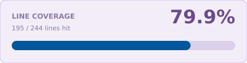

<a name="readme-top"></a>

<!-- Top Links Bar -->

<a href="#test-coverage"></a>

[](https://www.linkedin.com/in/tanja-polz-5636401a5/)
[](https://twitter.com/_foxnoir_?lang=de)
[](https://www.instagram.com/codeincouture/)

<!-- PROJECT LOGO -->
<br />

<div align="center">
  
  <h1 align="center">Riverpod Basic Starter</h1>
  <p>
     Starter for Riverpod — copy this app when you begin a new project.
  </p>
</div>

---

<div align="left">

[](https://flutter.dev/)
[](https://dart.dev/)
[](https://pub.dev/packages/flutter_riverpod)
[](https://pub.dev/packages/go_router)
[](https://docs.flutter.dev/ui/internationalization)
[](https://pub.dev/packages/intl)
[](https://pub.dev/packages/very_good_analysis)
[](https://fvm.app)
[](https://developer.apple.com/ios/)
[](https://docs.flutter.dev/platform-integration/web)

</div>

<details>
  <summary>Table of Contents</summary>
  <ol>
    <li><a href="#about">About</a></li>
    <li><a href="#features">Features</a></li>
    <li>
      <a href="#getting-started">Getting Started</a>
      <ul>
        <li><a href="#test-coverage">Test coverage</a></li>
      </ul>
    </li>
  </ol>
</details>

---

## About

This is a **Riverpod** starter in [Noir's Flutter Playground](../../README.md). Copy the folder and rename the Dart package.

[](https://developer.apple.com/ios/)
[](https://docs.flutter.dev/platform-integration/web)

There is no Android project. Run on the iOS Simulator or Chrome.

<p align="right"><a href="#readme-top">back to top</a></p>

---

## Features

- **iOS + Web** (no Android)
- [Riverpod](https://pub.dev/packages/flutter_riverpod) (`ProviderScope`)
- [GoRouter](https://pub.dev/packages/go_router)
- l10n (English / German)
- Feature folders (`presentation` / `data` / `domain`)
- Material 3 seed theme
- [FVM](https://fvm.app) pin
- Coverage badge and card

<p align="right"><a href="#readme-top">back to top</a></p>

---

## Getting Started

Clone the playground, then open this project folder:

```
https://github.com/foxnoir/noirs_flutter_playground.git
```

```
git@github.com:foxnoir/noirs_flutter_playground.git
```

```
cd app_starters/riverpod_basic_starter
fvm install
fvm flutter pub get
fvm flutter run
```

`fvm flutter run` uses the **iOS Simulator**. For web, use `fvm flutter run -d chrome`. There is no Android project.

This project is pinned with [FVM](https://fvm.app). After `fvm install`, Cursor uses the SDK at `.fvm/flutter_sdk`.

### Test coverage

<!-- coverage-percent:start -->
**66.0%** line coverage (68 of 103 lines).
<!-- coverage-percent:end -->



The card and the header badge are regenerated by the playground [coverage pipeline](../../README.md#coverage-pipeline) when you run `./coverage_pipeline/update_all.sh`. They are **not** updated on commit. On **push**, tests must pass (`pre-push`); GitHub Actions also runs tests on Linux and does **not** commit the SVGs. `fvm flutter test --coverage` only writes local `lcov.info` for **Coverage Gutters**, and only for files the tests loaded. Unused `lib/` files are added as 0 hits when the playground generator runs. Saving a Dart file does not update the SVGs by itself.

```
cd app_starters/riverpod_basic_starter
fvm flutter test --coverage
```

Or run the VS Code task **Flutter: Test with coverage**, then Command Palette → **Coverage Gutters: Display Coverage**.

How the badges are produced: playground [coverage pipeline](../../README.md#coverage-pipeline).

<p align="right"><a href="#readme-top">back to top</a></p>

