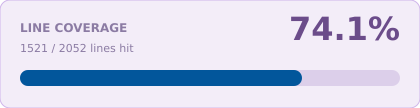

<a name="readme-top"></a>

<!-- Top Links Bar -->

<a href="#test-coverage"></a>

[](https://www.linkedin.com/in/tanja-polz-5636401a5/)
[](https://twitter.com/_foxnoir_?lang=de)
[](https://www.instagram.com/codeincouture/)

<!-- PROJECT LOGO -->
<br />

<div align="center">
  
  <h1 align="center">Firebase in Depth</h1>
  <p>
     Web-first Firestore lab: documents, collections, and indexes.
  </p>
</div>

---

<div align="left">

[](https://flutter.dev/)
[](https://dart.dev/)
[](https://pub.dev/packages/flutter_riverpod)
[](https://pub.dev/packages/riverpod_lint)
[](https://pub.dev/packages/freezed)
[](https://pub.dev/packages/go_router)
[](https://docs.flutter.dev/ui/internationalization)
[](https://pub.dev/packages/intl)
[](https://firebase.google.com/)
[](https://firebase.google.com/docs/firestore)
[](https://pub.dev/packages/very_good_analysis)
[](https://fvm.app)
[](https://docs.flutter.dev/platform-integration/web)
[](https://developer.apple.com/ios/)

</div>

<details>
  <summary>Table of Contents</summary>
  <ol>
    <li><a href="#about">About</a></li>
    <li><a href="#features">Features</a></li>
    <li>
      <a href="#firestore">Firestore</a>
      <ul>
        <li><a href="#documents-and-collections">Documents and collections</a></li>
        <li><a href="#primary-key-versus-unique-identifier">Primary key versus unique identifier</a></li>
        <li><a href="#large-collection-of-small-documents">Large collection of small documents</a></li>
        <li><a href="#nested-collections">Nested collections</a></li>
        <li><a href="#nested-versus-two-root-collections">Nested versus two root collections</a></li>
        <li><a href="#collection-group-queries">Collection group queries</a></li>
        <li><a href="#realtime-snapshots">Realtime snapshots</a></li>
        <li><a href="#courses-in-this-project">Courses in this project</a></li>
        <li><a href="#freezed">Freezed</a></li>
        <li><a href="#performance-guarantees-and-indexes">Performance guarantees and indexes</a></li>
        <li><a href="#single-field-exemptions">Single-field exemptions</a></li>
      </ul>
    </li>
    <li>
      <a href="#web-first">Web first</a>
      <ul>
        <li><a href="#inspecting-responses">Inspecting responses</a></li>
        <li><a href="#postman">Postman</a></li>
      </ul>
    </li>
    <li>
      <a href="#getting-started">Getting Started</a>
      <ul>
        <li><a href="#test-coverage">Test coverage</a></li>
      </ul>
    </li>
        <li><a href="#firebase-course-lab">Firebase Course Lab</a></li>
        <li><a href="#firebase-fundamentals">Firebase Fundamentals</a></li>
    <li><a href="#errors">Errors</a></li>
  </ol>
</details>

---

## About

This project is the **Firebase** practice project in [Noir's Flutter Playground](../README.md). **Web first** (Chrome). State is [Riverpod](https://pub.dev/packages/flutter_riverpod). The app started from the [Riverpod Basic Starter](../app_starters/riverpod_basic_starter/README.md): GoRouter, l10n, feature folders, sealed errors.

The Firestore collection [`courses`](https://console.firebase.google.com/project/fir-in-depth-813e4/firestore/databases/-default-/data/~2Fcourses) is seeded (Japanese courses, nested `tutor` map). **Firebase Fundamentals** is the lab in this app:

- read the collection
- read one document by id
- four queries: automatic index, two inequalities, composite `url` + `seqNo`, missing `price` + `seqNo`
- nested `lessons` under one course vs `collectionGroup('lessons')` for every lesson
- realtime `snapshots()` on `courses` plus `FieldValue.increment` on `participants`

Last practice app in the playground for now.

Flutter CRUD, offline cache, the **local emulator**, and **Storage** are not wired yet.

[](https://docs.flutter.dev/platform-integration/web)
[](https://developer.apple.com/ios/)

iOS Simulator still runs. The browser document title is **Firebase in Depth** (`web/index.html` `<title>`, `onGenerateTitle`).

<p align="right"><a href="#readme-top">back to top</a></p>

---

## Features

- **Web first** (Chrome), plus iOS
- [Riverpod](https://pub.dev/packages/flutter_riverpod) (`ProviderScope`)
- [GoRouter](https://pub.dev/packages/go_router)
- l10n (English / German)
- Feature folders (`presentation` / `data` / `domain`)
- **Landing Screen** (`LandingScreen`) — website header + cards, GoRouter hub
- **Firebase Course Lab** — Home with `PageView` (beginner / advanced)
- `assets/img/bg.webp` behind every page (`AppBackground`)
- **Firebase Fundamentals** — collection / document reads, index lab, nested lessons vs collection group, realtime snapshots
- Sealed `AppException` / `AppFailure` with l10n mapping
- [Freezed](https://pub.dev/packages/freezed) for Firestore models and entities (`Course` / `Tutor` / `Lesson`)
- Material 3 seed theme
- [Firebase](https://firebase.google.com/) (`firebase_core`, web + iOS on `fir-in-depth-813e4`)
- [Firestore](https://firebase.google.com/docs/firestore) collection `courses` (seeded; Course Lab owns the data layer, Fundamentals uses it)
- [FVM](https://fvm.app) pin
- Coverage badge and card

Coming: Firestore CRUD in the app, emulator, Storage / photo upload.

<p align="right"><a href="#readme-top">back to top</a></p>

---

## Firestore

[Data model](https://firebase.google.com/docs/firestore/data-model): collections hold documents. Documents hold fields. That is the whole tree.

### Documents and collections

A **document** is one record. It has an ID (`hiragana-from-zero`) and a map of fields (`description`, `tutor`, …). You read and write the document as a whole. Max size is **1 MiB**. An empty document can still exist as a path so a subcollection has a parent.

A **collection** is a named list of documents (`courses`). It does not store fields of its own. It is not created up front — it appears when the first document is written, and it disappears when the last one is gone.

The path always alternates: `collection / document / collection / document`. You cannot put a collection inside a collection, or a document inside a document.

### Primary key versus unique identifier

SQL gives you both: a **primary key** (the row's identity) and extra **UNIQUE** columns (email, slug) that the database rejects on duplicate.

Firestore only guarantees uniqueness for the **document ID**, and only **inside that collection**. That ID is the primary key analogue. There is no UNIQUE constraint on a field. Two courses may both have `url: "hiragana-from-zero"`; Firestore will not care.

If a value must be unique, **make it the document ID**. This seed uses the slug (`hiragana-from-zero`) as the ID. The `url` field copies that slug for the app — it is not a second unique key. Auto-IDs (`Bir3OG4ZSoyMRAOSg9MB`) are unique and opaque. Fine when you have no natural key. Awkward in URLs and in teaching paths.

Uniqueness does not cross collections. `lessons/vowels` under Hiragana and `lessons/vowels` under Kanji are different documents. A unique email in `users` means the document ID *is* the email (or a lookup collection), not a `email` field with a unique index.

### Large collection of small documents

Firestore is built for **many small documents**, not one fat document that contains a list of everything.

A course with 200 lessons as an array on the course document would hit the size cap, download all lessons when you only wanted the title, and make every write contend on that one doc. Prefer `courses` (eight small course docs) and later `lessons` as their own documents. List queries + `limit` / `startAfter` then load a page, not the world.

Small, bounded arrays on a document are still fine (`categories`, `tutor.employedSince`). Unbounded lists are not.

### Nested collections

A document may have **subcollections**. The children are not fields on the parent. They live at a nested path:

```text
courses / hiragana-from-zero                 ← course: slug is the document ID
courses / hiragana-from-zero / lessons / {autoId}
```

Course IDs are slugs (`hiragana-from-zero`) — a natural unique identifier. Lesson IDs are **auto-generated**. A lesson has no stable unique key of its own; `seqNo` is only order inside that course, not an ID. Click the lesson in the console to open the **fourth** column (`description`, `duration`, `seqNo`). The collection list shows IDs only.

Some courses have a `lessons` subcollection (Hiragana, Kanji, Keigo). The others do not — a missing nested collection is normal, not an error. `lessonsCount` on the course matches the seeded lesson docs. Deleting the course document does **not** delete `lessons`.

### Nested versus two root collections

Nest when the child **cannot exist without** the parent. A lesson is not a standalone catalog item — it belongs to one course. Path `courses/{id}/lessons/{lessonId}` is the ownership. The usual query is “lessons of this course”; security rules can match that path. You do not need a `courseId` field for that.

Use **two root collections** when both entities have their own life. `users` and `courses` stay siblings: a user is not deleted with a course. Same if you mostly list *all* lessons in the project with no course in hand — that is either a [collection group](https://firebase.google.com/docs/firestore/query-data/queries#collection-group-query) or a root `lessons` collection plus `courseId`. Do not nest only to make the console look tidy.

“Cannot exist without” is a **domain** rule. Firestore has no foreign key and no cascade delete. If you remove a course, delete its `lessons` yourself (or with a Function).

### Collection group queries

A nested read stays under one parent:

```text
courses / hiragana-from-zero / lessons   →   orderBy seqNo
```

That is **Read nested lessons**. Automatic single-field index. Only that course.

**Run collection-group query** is one query across every `lessons` subcollection, whatever the parent:

```dart
FirebaseFirestore.instance.collectionGroup('lessons').orderBy('seqNo')
```

There is no `courseId` field on the document. The lab reads it from `snapshot.reference.parent.parent` (the course doc). `orderBy seqNo` then mixes courses: every seqNo 1, then every seqNo 2.

Two extra pieces, or the button fails:

| Piece | Why |
| --- | --- |
| Rule `match /{path=**}/lessons/{id}` | Nested `match /courses/{id}/lessons/{id}` is not enough for a collection group |
| Index `queryScope: COLLECTION_GROUP` on `lessons.seqNo` | Single-field indexes are per collection path, not across parents |

Both are in this repo (`firestore.rules`, `firestore.indexes.json`). Deploy, or tap the button and CREATE from the Console URL. Unlike **Run missing-index query**, this index you **do** want.

### Realtime snapshots

**Listen** is `orderBy('seqNo').snapshots()` — AngularFire `snapshotChanges()`. The stream stays open. First event: every current course as `added`. Later: `added` / `modified` / `removed` in `docChanges`. **Stop** cancels the subscription.

**Increment** writes `FieldValue.increment(1)` on `hiragana-from-zero.participants`. Two clients cannot overwrite each other. The same number in the Console also pushes a `modified` event. Rules allow only that field — publish `firestore.rules` (Console or CLI) or the write fails.

**Watch it in DevTools.** Open Chrome **DevTools** → **Network** → filter `firestore` *before* you tap. **Listen** dumps the first Listen/`channel` payload (the full current query). After that, keepalives stay tiny until something changes. **Increment** should show a **new** call: the write, then the snapshot update. No new dump = the write did not land (usually undeployed rules).

The Angular course uses RxJS **`first()`** and **`take(n)`** on that Observable. Dart’s `Stream` has the same operators:

| Operator | What it does |
| --- | --- |
| `snapshots().first` | `Future` of the first snapshot, then unsubscribe |
| `snapshots().take(n)` | emit **n** snapshots, then close (unsubscribe) |
| `snapshots().take(1)` | same idea as `first` — one emission, then done |

`get()` is still the one-shot read. `first` / `take(1)` *look* like `get()` from the app, but they open a **Listen** and cancel after the first snapshot. Cost and DevTools traffic are not identical to `get()`.

This lab does not call `first` / `take`. **Listen** + **Stop** is the same idea by hand: stay subscribed, or cancel. Use `take(n)` when you want a finite stream without a Stop button.

<p align="right"><a href="#readme-top">back to top</a></p>

### Courses in this project

This playground still keeps **the same fields on every course**. Firestore is **schemaless** — two documents in `courses` *may* have different fields, missing keys, or different types for the same name. The database will not stop you. Queries (`orderBy('seqNo')`), Dart models, and the UI should not have to guess whether `tutor` or `price` exists. Different schemas are a lab later (optional fields, migration), not the seed.

| Field | Type | Notes |
|---|---|---|
| `description` | string | Short title |
| `longDescription` | string | One paragraph |
| `url` | string | Same as the document ID |
| `seqNo` | number | List order / pagination cursor. Keep it a number, not `"1"`. |
| `lessonsCount` | number | Denormalized. Do not count a subcollection on every list read. |
| `price` | number | |
| `categories` | array of string | Small and bounded. Seed: `BEGINNER` or `INTERMEDIATE`. Home `array-contains` those strings. Angular’s sample used `ADVANCE` (typo) — we do not. |
| `icon` | string | `purple` / `light_purple` / `green` / `turquoise` → `assets/icons/courses/course_$icon.png` |
| `tutor` | map | Nested object: `name` (string), `employedSince` (array `[year, month, day]`) |
| `participants` | number | Optional. Missing reads as `0`. Realtime lab increments this field. |

Lesson documents (where the subcollection exists) — three fields only, same shape as a typical Firestore course sample:

| Field | Type | Notes |
|---|---|---|
| `description` | string | Lesson title |
| `duration` | string | `MM:SS`, e.g. `06:05` |
| `seqNo` | number | Order inside that course. Not a unique identifier. |

Lesson document IDs are auto-generated. No `url` / `courseId` on the lesson. The parent path is the course.

**Keep arrays short.** A document is downloaded as a whole (max 1 MiB). `array-contains` is for small, stable lists. Do not grow an unbounded array on the course (`lessons`, comments, students). Those belong in a **subcollection**. `Timestamp` is the type you want when you start range-querying dates.

### Freezed

Same fields on every course is what makes a Freezed class practical: `Course` + nested `Tutor`, `fromJson` via **json_serializable** for the Firestore map. Packages land with that feature. How codegen works (and when *not* to use Freezed) is in [Riverpod Basics → Freezed](../riverpod_basics/README.md#freezed).

Use it for document shapes and for UI state that is more than one field. Do not Freezed a widget, a repository, or a single `String`.

`Course` / `Tutor` (and their models) live **inside Firebase Fundamentals**. That is a bit dirty: a later Courses feature will need the same shape again. Feature-first still wins here — this lab is a fake, not a shared catalog. We do not lift models into `core/` just to avoid the copy.

<p align="right"><a href="#readme-top">back to top</a></p>

---

## Performance guarantees and indexes

Firestore does not scan a collection to answer a query. It walks an **index** — a sorted list of field values plus document IDs. That is the performance guarantee: the work stays proportional to the result, not to how many courses you stored. Allowed queries are the ones an index can answer without a collection scan.

**Rule of thumb (this lab).** `<` `<=` `>` `>=` only **once**, on **one** field, in the same query — and `orderBy` on that same field. A second field is allowed only with `==`. Two range filters on two fields is the invalid query, not a missing index.

This is **not** about index size. `seqNo` and `lessonsCount` each already have an index. The rules are about **operators** (`==` vs `<=`) and whether Firestore has a **combined** register for two fields together.

**Automatic single-field indexes.** Every field gets one (Console → Indexes → Single field). Think of a phone book per field: look up `seqNo`, or look up `url`, not both at once. `where('seqNo', isLessThanOrEqualTo: 5).orderBy('seqNo')` uses only the `seqNo` book. Inequality and `orderBy` must start on **the same field**, because that is the sort order of that index. This is **Run valid query** (and the Angular sample that works without CREATE).

### Single-field exemptions

Automatic indexing is the default. An **exemption** turns it off for one field in one collection (Console → Indexes → Single field → **Add exemption**, or `fieldOverrides` in `firestore.indexes.json`). Use it when a field will never appear in a `where` / `orderBy` — you save a bit of write cost and index storage.

You almost never need one. This lab has none (`fieldOverrides` is `[]`). Leave Arrays enabled. Do not exempt `seqNo`, `url`, or `price`, or the Fundamentals buttons stop matching the story above.

**Two inequalities on different fields.** Not a missing index. The course query is:

```text
where seqNo <= 5
where lessonsCount <= 10
orderBy seqNo
```

Two range filters (`<` `<=` `>` `>=`) on **two fields**. Both fields have single-field indexes. Firestore still rejects the combination: walking the `seqNo` book cannot cheaply apply a second *range* on `lessonsCount`. Creating a composite index does not make the course-era rule go away. **Run invalid query** is this shape (`fetchCoursesSeqNoAndLessonsCount`). The error is *Invalid query*, not *requires an index*:

```text
FirebaseError: Invalid query.
All where filters with an inequality (<, <=, !=, not-in, >, or >=)
must be on the same field. But you have inequality filters on
'seqNo' and 'lessonsCount'.
```

**Range + equality.** `where seqNo <= 20` plus `where url == hiragana-from-zero` plus `orderBy seqNo` is not two ranges — `url` is a point lookup. That pair needs a **composite** index (`url` then `seqNo`). **Run composite-index query** is this shape (`fetchCoursesSeqNoAndUrl`). The index lives in `firestore.indexes.json` and in the Console (CREATE from the error URL, or `firebase deploy --only firestore:indexes`).

**Run missing-index query** is the same *shape* on a pair that is **not** in that file: `seqNo <= 20` plus `price == 15` (`fetchCoursesSeqNoAndPrice`). Without that composite:

```text
FirebaseError: The query requires an index.
You can create it here: https://console.firebase.google.com/...
```

In the Angular course that is the error he clicks. Do **not** click-create `price` + `seqNo` if you want **Run missing-index query** to keep demonstrating the URL.

| Lab button | Query | Single-field indexes exist? | What is wrong |
|---|---|---|---|
| Run valid query | `seqNo <= 5`, `orderBy seqNo` | yes | nothing — one field, automatic index |
| Run invalid query | `seqNo <= 5` **and** `lessonsCount <= 10` | yes | two ranges — rule, not a missing index |
| Run composite-index query | `seqNo <= 20` **and** `url == hiragana-from-zero` | yes | nothing — composite `url` + `seqNo` exists |
| Run missing-index query | `seqNo <= 20` **and** `price == 15` | yes | **composite** `price` + `seqNo` was never created |

**What changed for two inequalities.** Since 2024 Firestore *can* run range filters on multiple fields, but only with a composite index and with `orderBy` covering those fields. Without that index the backend returns `failed-precondition` (same `InvalidQueryFailure` as the missing-index case). The two-inequality button still sends the course query as-is.

The working mental model: **one range + orderBy on that field** = automatic index. **Range + equality on another field** = composite index (Console URL). **Two ranges on two fields** = either forbidden (course) or another composite index (today). None of that is free, because the performance guarantee would break.

<p align="right"><a href="#readme-top">back to top</a></p>

---

## Web first

This app is meant to be run in **Chrome**, so Firestore traffic is visible. The document title in the tab is **Firebase in Depth**.

```
cd firebase_in_depth
fvm flutter run -d chrome
```

Or the VS Code / Cursor launch config **Firebase in Depth** (Chrome). **Firebase in Depth (iOS)** is the Simulator.

### Inspecting responses

**Web (use this).** Chrome DevTools → **Network**. Filter `firestore`. The web SDK talks HTTPS to `firestore.googleapis.com` (Listen / channel). You see status, timing, and payload. The payload is not a pretty REST JSON document — it is the SDK wire format. The [Console](https://console.firebase.google.com/project/fir-in-depth-813e4/firestore/databases/-default-/data/~2Fcourses) is still the place to *read* fields. DevTools is the place to see *that a request happened*.

**iOS Simulator.** The native SDK uses gRPC, not the browser. Safari Web Inspector and Flutter DevTools Network do not show those calls. A proxy (Proxyman / Charles) can, with TLS hassle. For watching Firestore, stay on web.

Widget tests skip `Firebase.initializeApp` (VM is neither web nor iOS).

### Postman

The Flutter SDK does not speak REST. Firestore still has a REST API. `courses` is **public read** in `firestore.rules` (`allow read: if true`). No Auth, no API key, no Bearer. Do **not** paste `apiKey` from `firebase_options.dart`.

Skip “Connect a local project folder” on first launch. New → **HTTP**. Authorization stays **No Auth**.

**GET one document**

```
https://firestore.googleapis.com/v1/projects/fir-in-depth-813e4/databases/(default)/documents/courses/hiragana-from-zero
```

**GET the collection**

```
https://firestore.googleapis.com/v1/projects/fir-in-depth-813e4/databases/(default)/documents/courses
```

`(default)` is the database id, including the parentheses. The JSON is REST typed (`integerValue`, `stringValue`), not `snap.data()`. Use it to check field names (`icon`, nested `tutor`). `CourseModel.fromJson` still needs the SDK map.

**Environment** (values, not secrets). Create environment **Firebase in Depth**, pick it in the top-right dropdown (not **No environment**), then put `{{…}}` in the URLs:

| Variable | Value |
|---|---|
| `projectId` | `fir-in-depth-813e4` |
| `database` | `(default)` |
| `collection` | `courses` |
| `docId` | `hiragana-from-zero` |

```
https://firestore.googleapis.com/v1/projects/{{projectId}}/databases/{{database}}/documents/{{collection}}/{{docId}}
```

```
https://firestore.googleapis.com/v1/projects/{{projectId}}/databases/{{database}}/documents/{{collection}}
```

Collection **Firestore courses** → folder **reads** → save those two GETs. Change `docId` in the environment to hit another course; leave the requests as they are.

**POST query** (same shape as **Run valid query**). URL:

```
https://firestore.googleapis.com/v1/projects/{{projectId}}/databases/{{database}}/documents:runQuery
```

Body → raw JSON:

```json
{
  "structuredQuery": {
    "from": [{ "collectionId": "courses" }],
    "where": {
      "fieldFilter": {
        "field": { "fieldPath": "seqNo" },
        "op": "LESS_THAN_OR_EQUAL",
        "value": { "integerValue": "5" }
      }
    },
    "orderBy": [
      {
        "field": { "fieldPath": "seqNo" },
        "direction": "ASCENDING"
      }
    ]
  }
}
```

The missing-index and two-range queries fail here the same way as in the app. If rules later deny unauthenticated reads, this GET returns 403 — then you would need a token. Today you do not.

<p align="right"><a href="#readme-top">back to top</a></p>

---

## Getting Started

Clone the playground, then open this project folder:

```
https://github.com/foxnoir/noirs_flutter_playground.git
```

```
git@github.com:foxnoir/noirs_flutter_playground.git
```

```
cd firebase_in_depth
fvm install
fvm flutter pub get
fvm flutter run -d chrome
```

**Web first.** `fvm flutter run -d chrome` initializes Firebase for web. Launch config **Firebase in Depth** is Chrome; **Firebase in Depth (iOS)** is the Simulator (**iPhone 17 Pro**, iOS 26.5). See [Web first](#web-first) for DevTools.

This project is pinned with [FVM](https://fvm.app). After `fvm install`, Cursor uses the SDK at `.fvm/flutter_sdk`.

Firestore **rules** in this folder allow client **reads** on `courses` and on `lessons` (nested path **and** collection group `match /{path=**}/lessons/{id}`). The only client **write** is updating `participants` on a course (`FieldValue.increment`). Everything else stays denied. Collection-group reads and the increment fail until those rules are deployed:

```
npx firebase-tools@13.35.1 deploy --only firestore:rules,firestore:indexes --project fir-in-depth-813e4
```

### Test coverage

<!-- coverage-percent:start -->
**70.9%** line coverage (895 of 1263 lines).
<!-- coverage-percent:end -->



The card and the header badge are regenerated on **playground commit** (git hooks at the repo root) when tests pass. A failing test does not block the commit; **push** still requires green tests (`pre-push`). GitHub Actions runs tests on Linux and does **not** commit the SVGs. `fvm flutter test --coverage` only writes local `lcov.info` for **Coverage Gutters**, and only for files the tests loaded. Unused `lib/` files are added as 0 hits when the playground generator runs. Saving a Dart file does not update the SVGs by itself.

```
cd firebase_in_depth
fvm flutter test --coverage
```

Or run the VS Code task **Flutter: Test with coverage**, then Command Palette → **Coverage Gutters: Display Coverage**.

How the badges are produced: playground [coverage pipeline](../README.md#coverage-pipeline).

<p align="right"><a href="#readme-top">back to top</a></p>

---

## Errors

Thrown objects and UI copy are different types. No extra package: Dart 3 **`sealed class`** is enough.

- Data sources throw **`AppException`**: `NetworkException`, `NotFoundException`, `PermissionException`, `InvalidQueryException`. Unknown errors are wrapped here.
- Repositories catch **`on AppException`** and `throw AppFailure.fromException(e)`. No dartz — throwing the failure is `Left`.
- Notifiers store that `AppFailure`. They do not map.
- UI calls **`failure.message(l10n)`** or **`localizedError(l10n, error)`**. Never `toString()`.

Files: `lib/core/errors/`. Copy lives in ARB (`errorNetwork`, `errorNotFound`, `errorPermission`, `errorInvalidQuery`, `errorOccurred`). **`ErrorWidget`** (`lib/shared_widgets/error_widget.dart`) is the shared error screen (icon + message + optional retry). Import material with `hide ErrorWidget`. `InvalidQueryFailure` may show the Firestore `message` (index URL / “two inequality fields”) when the backend sent one.

**Firebase Fundamentals** is the working Firestore example: `CourseLabDataSourceImpl` throws `AppException` (`AppException.fromFirebase` on the sealed class in `core/errors/`); `CourseLabRepositoryImpl` maps to `AppFailure`; the lab notifier stores `AsyncValue`s; the UI calls `localizedError`.

Form validation is not a fetch failure. Keep those as field/form strings.

<p align="right"><a href="#readme-top">back to top</a></p>

---

## Firebase Course Lab

**Landing Screen** → **Firebase Course Lab** (`goNamed` `home`). Home is a **PageView**: **Beginner course** / **Advanced course** slide left and right (tap the links or swipe). Both pages share the same height. Background is `assets/img/bg.webp` on every `SiteScaffold` page. The chrome is a website header (`SiteHeader`): **Home** (landing), then **Fundamentals**, then **Lab** (course catalog). Landing cards put Fundamentals on the left and Course Lab on the right.

Opening Home loads **both** tracks at once: two `array-contains` queries on `categories` (`BEGINNER` and `INTERMEDIATE`) in parallel, then each panel lists the matching courses. That is a lab choice — the point here is to try `array-contains`. In a product it can be smarter to fetch Advanced only after that page is selected. Decide per project.

The Advanced page queries **`INTERMEDIATE`**, because that is what the seed actually stored (Keigo, counters, onomatopoeia). Angular’s sample used `ADVANCE` (typo). There is no `ADVANCED` value in these documents — `array-contains` is an exact string match, so a wrong token returns an empty list, not an error. The query has no `orderBy` (no extra composite index); Home sorts by `seqNo` in Dart.

Course Lab owns **data + domain** for `courses`: `CourseLabDataSource`, `CourseLabRepository`, models, entities. Home is presentation (`PageView`, notifier) and reads through that repository (`fetchCoursesByCategory`).

**Firebase Fundamentals** is the small query/index/realtime workbench. It has **no** data layer of its own. Its notifier calls `CourseLabRepository` — Fundamentals → Course Lab, not the other way around.

Either direction breaks strict **feature-first**. Copying the Firestore stack into both features would be worse. A shared `core` data layer would also be valid; this playground does **not** extract one, and the rest of the repo is not all wired the same way. Here Course Lab is the main lab (the catalog), Fundamentals is a testing area, so the data lives under Course Lab.

<p align="right"><a href="#readme-top">back to top</a></p>

---

## Firebase Fundamentals

**Landing Screen** → **Firebase Fundamentals** (`goNamed`). Run in **Chrome**. Open DevTools → Network → filter `firestore` *before* tapping buttons, or you miss the call.

The screen does not fetch on load. Each button is one read, except **Listen** which opens `snapshots()` until **Stop**. Leave **DevTools** → **Network** (filter `firestore`) open: **Listen** dumps the first channel payload; **Increment** should add a **new** call. From **600px** (Material medium) **Read collection** and **Read document** sit in a row; below that working queries are on the left and the two that fail are stacked on the right. Realtime is listen + change log. Buttons use teal when the read should succeed and the error rose when it should fail — they do not stretch full width.

| Button | What it does |
|---|---|
| Read collection | `courses` ordered by `seqNo` |
| Read document | `courses/hiragana-from-zero` — one id, not “the first course in the list” |
| Run valid query | `seqNo <= 5`, `orderBy seqNo` — automatic index |
| Run invalid query | `seqNo <= 5` **and** `lessonsCount <= 10` — two inequalities |
| Run composite-index query | `seqNo <= 20` **and** `url == hiragana-from-zero` — composite in `firestore.indexes.json` |
| Run missing-index query | `seqNo <= 20` **and** `price == 15` — Console URL |
| Read nested lessons | `courses/hiragana-from-zero/lessons` ordered by `seqNo` |
| Run collection-group query | `collectionGroup('lessons')` ordered by `seqNo` — needs COLLECTION_GROUP index + recursive rule |
| Listen | `courses.orderBy('seqNo').snapshots()` — AngularFire `snapshotChanges` is this stream plus `docChanges` |
| Stop | Cancel the subscription |
| Increment participants | `FieldValue.increment(1)` on `hiragana-from-zero.participants` — or set the number in the Console |

Names follow the feature, like Sealed Lab — no extra `Firestore` / `Course` prefix. **Contracts** (`CourseLabDataSource`, `CourseLabRepository`) live under **Course Lab** (`course_lab/data`, `course_lab/domain`). Fundamentals is presentation only and **uses that repository**. **`*Impl`** lives in `*_impl.dart`; the repository test is `*_impl_test.dart`. The lab is the **screen**; the blocks are `ReadSection`, `QuerySection`, `LessonsSection`, `RealtimeSection`. Collection group is `collectionGroup('lessons').orderBy('seqNo')` in the data source impl. Realtime is `snapshots()` + `docChanges`; increment is `FieldValue.increment`. Layers match the playground [folder structure](../README.md#app-architecture-and-folder-structure). Freezed `Course`, `Tutor`, and `Lesson` are separate files (entity + model). Tests fake the **repository** (`AppFailure`) or the **data source** (`AppException`), or construct `*Impl` with a fake. They do not hit live Firestore.

Why the failing queries fail: [Performance guarantees and indexes](#performance-guarantees-and-indexes). Nested vs all lessons: [Collection group queries](#collection-group-queries). Live updates: [Realtime snapshots](#realtime-snapshots) — **Listen**, then increment or edit `participants` in the Console. `first` / `take(n)` are in that section.

<p align="right"><a href="#readme-top">back to top</a></p>
