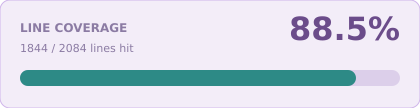

<a name="readme-top"></a>

<!-- Top Links Bar -->

<a href="#test-coverage"></a>

[](https://www.linkedin.com/in/tanja-polz-5636401a5/)
[](https://twitter.com/_foxnoir_?lang=de)
[](https://www.instagram.com/codeincouture/)

<!-- PROJECT LOGO -->
<br />

<div align="center">
  
  <h1 align="center">Riverpod Basics</h1>
  <p>
     Practice project for Riverpod: providers, labs (listen, ConsumerWidget, Quote, Tick, Auth, refresh / invalidate, User List, User Search), Freezed, and sealed errors.
  </p>
</div>

---

<div align="left">

[](https://flutter.dev/)
[](https://dart.dev/)
[](https://pub.dev/packages/flutter_riverpod)
[](https://pub.dev/packages/freezed)
[](https://pub.dev/packages/go_router)
[](https://docs.flutter.dev/ui/internationalization)
[](https://pub.dev/packages/intl)
[](https://pub.dev/packages/very_good_analysis)
[](https://fvm.app)
[](https://developer.apple.com/ios/)

</div>

<details>
  <summary>Table of Contents</summary>
  <ol>
    <li><a href="#about">About</a></li>
    <li>
      <a href="#style-guide">Style Guide</a>
      <ul>
        <li><a href="#color-palette">Color Palette</a></li>
      </ul>
    </li>
    <li><a href="#example-screens">Example Screens</a></li>
    <li>
      <a href="#riverpod">Riverpod</a>
      <ul>
        <li><a href="#what-is-riverpod">What is Riverpod</a></li>
        <li><a href="#why-riverpod">Why Riverpod</a></li>
        <li><a href="#watch-read-listen">watch, read, listen</a></li>
        <li><a href="#refresh-invalidate">refresh, invalidate</a></li>
        <li><a href="#retry">retry</a></li>
        <li><a href="#three-switches">Three switches</a></li>
      </ul>
    </li>
    <li>
      <a href="#providers">Providers</a>
      <ul>
        <li><a href="#no-provider">No provider</a></li>
        <li><a href="#provider">Provider</a></li>
        <li><a href="#notifierprovider">NotifierProvider</a></li>
        <li><a href="#futureprovider">FutureProvider</a></li>
        <li><a href="#streamprovider">StreamProvider</a></li>
        <li><a href="#asyncnotifier-persistent-state">AsyncNotifier Persistent State</a></li>
        <li><a href="#asyncnotifier-non-persistent-state">AsyncNotifier Non-Persistent State</a></li>
        <li><a href="#stateprovider">StateProvider</a></li>
        <li><a href="#how-they-connect">How they connect</a></li>
        <li><a href="#which-provider">Which provider</a></li>
        <li><a href="#auth">Auth</a></li>
        <li><a href="#riverpod-apis">Riverpod APIs</a></li>
      </ul>
    </li>
    <li>
      <a href="#freezed">Freezed</a>
      <ul>
        <li><a href="#what-is-freezed">What is Freezed</a></li>
        <li><a href="#why-freezed">Why Freezed</a></li>
        <li><a href="#custom-state-classes">Custom State Classes</a></li>
        <li><a href="#codegen">Codegen</a></li>
      </ul>
    </li>
    <li>
      <a href="#errors">Errors</a>
      <ul>
        <li><a href="#two-types">Two types</a></li>
        <li><a href="#where-mapping-lives">Where mapping lives</a></li>
      </ul>
    </li>
    <li><a href="#getting-started">Getting Started</a></li>
    <li>
      <a href="#testing">Testing</a>
      <ul>
        <li><a href="#testing-in-flutter">Testing in Flutter</a></li>
        <li><a href="#testing-riverpod">Testing Riverpod</a></li>
        <li><a href="#what-to-test">What to test</a></li>
        <li><a href="#test-coverage">Test coverage</a></li>
      </ul>
    </li>
    <li><a href="#changelog">Changelog</a></li>
    <li><a href="#sources">Sources</a></li>
  </ol>
</details>

---

## About

This app is the **Riverpod** practice project in [Noir's Flutter Playground](../README.md).

The landing page has two sections: **Providers** and **Labs**.

**Providers** is the same counter five ways: local `setState`, `StateProvider`, `NotifierProvider`, then `AsyncNotifierProvider` with persistent and autoDispose lifetime. Details are under [Providers](#providers).

**Labs** go further. **AutoDispose Provider Lifetimes** compares persistent, autoDispose, and keep-alive on one screen. **User List** owns the `User` entity, `UserModel`, the data source, the repository, and `UserListState`. **Add User** is a form that writes into that list — it imports User List directly (feature-first, no shared folder). **User Search** is one field, two providers: a **Notifier** `search()` command and a codegen **Family** `userSearchFamilyProvider(query)`. The handwritten `.family` twin is `user_search_family_provider_manual.dart` (not imported). **LabInfoText** renders lab info (`**bold**`, paragraphs); User Search is left-aligned so it does not read as a justified block. A miss shows a spinner in both panels, then one `not_found_dragon.png` (empty filter, not `NotFoundFailure`). **Listen Manual** puts `listen` in `build` next to `listenManual` in `initState`, so you can see which one runs when an error is already stored. **Consumer Widget** shows the same list twice: `StatelessWidget` + `Consumer` versus `ConsumerWidget`. **Quote** compares two handwritten fake GETs /quote: **FutureProvider** (reload is `invalidate`, **Fail call** sets a data-source flag then `invalidate`s) and **FutureProvider + input** (**Increment number** re-runs because a watched quote number changed; the other cache stays). **Tick** is a handwritten `StreamProvider<Tick>`: fake stream /tick with `Timer.periodic`, **Fail call** errors the next event with no `invalidate`, **Invalidate** starts a new stream at tick 1. **Auth** is a **Notifier** session plus a read-only **`Provider<GoRouter>`**: `login()` / `logout()` do not call `go()`; `redirect` + `refreshListenable` move you. The hub is public so other labs are not behind a wall. **Refresh** is a fake GET /ping: `ref.refresh` is `invalidate` + `read`; `invalidate` is void. Folder layout follows the [playground architecture](../README.md#app-architecture-and-folder-structure). Shared UI lives in `shared_widgets/`. The UI locale is English; German ARBs stay for tests. See [Freezed](#freezed) for models, entities, and screen state. See [Errors](#errors) for sealed exceptions, failures, and l10n mapping.

[](https://developer.apple.com/ios/)

There is no Android project or Chrome. Run on the iOS Simulator (**iPhone 17 Pro**, iOS 26.5).

<p align="right"><a href="#readme-top">back to top</a></p>

---

## Style Guide

Coming soon.

<p align="right"><a href="#readme-top">back to top</a></p>

### Color Palette


<p align="right"><a href="#readme-top">back to top</a></p>

---

## Example Screens

Coming soon.

<p align="right"><a href="#readme-top">back to top</a></p>

---

## [Riverpod](https://pub.dev/packages/flutter_riverpod)

### What is Riverpod

Riverpod is a **state management and dependency injection** framework for Flutter.

A provider is a declared source of data. Widgets subscribe to it. When the data changes, only the widgets that watch it rebuild.

That is the whole idea: state lives outside the widget tree, and the UI reacts to it.

<p align="right"><a href="#readme-top">back to top</a></p>

### Why Riverpod

`setState` is fine for local UI, but it does not scale once several screens need the same value.

The older `provider` package works, but it depends on `BuildContext`. That leads to easy mistakes: reading a provider from the wrong place in the tree, or failing tests because the widget tree is missing an ancestor.

Riverpod avoids that:

- Providers are **global declarations**, not inherited widgets. You do not need `context` to create or read them.
- **Compile-safe**: a missing provider is a type error, not a runtime crash.
- **Testable**: you can override providers in tests without wrapping the whole tree in the right ancestors.
- **Explicit rebuilds**: `ref.watch` rebuilds, `ref.read` does not. You choose.

Use Riverpod when state is shared, async, or needs to be tested. Keep `setState` for tiny local UI that never leaves one widget.

**`ConsumerWidget`** is a `StatelessWidget` whose `build` already has `ref`. **`StatelessWidget` + `Consumer`** does the same `watch`, but you wrap a builder just to get `ref`. Prefer `ConsumerWidget`. **`ConsumerStatefulWidget`** only when you need `initState` / `dispose`. The **Consumer Widget** lab shows the first two on the same user list.

<p align="right"><a href="#readme-top">back to top</a></p>

### watch, read, listen

These three are how a widget talks to a provider. Match the call to the job.

**`ref.watch(provider)`** subscribes. When the value changes, this widget rebuilds. Use it in `build` to **show** the value (`final count = ref.watch(counterStateProvider)`).

**Do not `watch` in a button callback.** A tap is not a rebuild. The subscribe would be wasted, and it is easy to think the UI will update from that line. It will not.

**`ref.read(provider)`** is a one-shot lookup. No subscribe, no rebuild. Use it in `onPressed` and in tests (`container.read` is the same idea): `ref.read(counterStateProvider.notifier).state++`.

**Do not `read` in `build` for a value you display.** The widget will not rebuild when the provider changes, so the text stays stale.

**`ref.listen(provider, (previous, next) { ... })`** runs a callback when the value **changes**. Use it for **side effects**: snackbar, dialog, navigation. Not for putting the number on screen — that is `watch`. A snackbar in `build` after `watch` would fire on every rebuild (keyboard, rotation, parent notify). `listen` fires once per change.

Call `listen` in `build`. Riverpod registers it; it does not stack a new subscription every frame. Do not put it in `onPressed`.

The callback gets `(previous, next)`. Add User ignores `previous` (`_`) and acts on `next`. Guard the “nothing happened” values: `if (!isAdded) return;` / `if (error == null) return;` so the reset after the side effect does not loop.

**`.select`** listens to one field so a list update does not open the duplicate-id dialog:

```
ref.listen(addUserProvider.select((state) => state.isAdded), (_, isAdded) { ... });
ref.listen(addUserProvider.select((state) => state.error), (_, error) { ... });
```

**One-shot flags.** `isAdded` is not “the user exists”. It is “show the snackbar now”. After the snackbar, **`acknowledgeAdded()`** sets it back to `false`. Without that, the next successful add is `true` → `true` and `listen` does not run. Same idea for `error` + **`clearError()`** after the dialog. Add User does this for the form; User List does it for `fetchUsers` errors.

**Use `listen` when** something must happen *because the value changed*, once, and is not a widget on screen.

**Do not use `listen` when** you need the value in the tree. That is `watch`. Do not `watch` a flag only to `showSnackBar` in `build`.

**`ref.listenManual`** is for `initState` (`ref.listen` / `ref.watch` are illegal there) plus **`fireImmediately: true`**: current value *and* later changes. The same snapshot without a subscription is **`ref.read` in `initState`**. `read` has no callback, so it never shows a dialog or SnackBar — the gray card is the whole effect. The **Listen Manual** lab color-codes the four APIs: purple `watch`, gray `read`, red `listenManual` (dialog), teal `listen` (SnackBar). Store an error while the screen is open: teal SnackBar + red dialog; gray `read` stays empty. Leave and come back: purple `watch` and gray `read` are filled; red dialog again; teal `listen` stays empty. `showDialog` waits until after the first layout. Close the `ProviderSubscription` in `dispose`.

Use `listenManual` when the side effect must see the current value on first open, or you must start/stop the listener outside `build`. Add User and User List stay on `listen` in `build`.

<p align="right"><a href="#readme-top">back to top</a></p>

### refresh, invalidate

These two tell Riverpod: **run this provider again**. They are not `watch` / `read` / `listen`. They are also not a method on a notifier (`fetchUsers()`, `reset()`).

**`ref.refresh(provider)` is always `invalidate` plus an immediate `read`.** Writing:

```
ref.refresh(provider);
```

is the same as:

```
ref.invalidate(provider);
ref.read(provider);
```

That `read` is why refresh **returns** the new value. On a `FutureProvider`, `ref.refresh(provider.future)` is the new GET as a `Future` — pull-to-refresh awaits that. `RefreshIndicator.onRefresh` needs a `Future`; `invalidate` is `void` and cannot go there.

**`ref.invalidate(provider)`** is **void**. Marks the provider stale. If something is watching, the GET runs again now. If nobody is looking, it waits until the next `watch` / `read`. Prefer **invalidate** unless this callback must wait. Several invalidates collapse into one rebuild; several refreshes do not.

The **Refresh** lab has its **own** `FutureProvider`: a delayed fake GET /ping. Fetch count is `.next()` on a **second** provider (`refreshPingCountProvider`). The Refresh button stays on **Waiting on Future…** until `await` completes. **Refresh 3x** stays on **Waiting on 3 Futures…**. Those two buttons disable while they wait so you cannot stack taps — that is our UI, not a Riverpod rule. Invalidate stays enabled while a Refresh waits. **Invalidate 3x** vs **Refresh 3x**: three invalidates schedule one GET; three refreshes start three. The **Refresh** button blinks once; **Refresh 3x** blinks three times. Prefer **invalidate** when this callback does not need to wait: save, delete, logout, or any stale cache. Whoever **watch**es reloads. `when(..., skipLoadingOnRefresh: false)` so the spinner shows.

This is not User List. `userListProvider.build()` returns empty state; the GET is `fetchUsers()`. Refreshing that provider would wipe the list. The async screens' refresh FAB is `reset()` on the notifier — same idea, not `ref.refresh`.

<p align="right"><a href="#readme-top">back to top</a></p>

### retry

Riverpod 3 **retries a failed async provider by itself** (~200ms, then again). That is not `ref.refresh`. Nobody tapped anything. The GET / stream runs again on its own.

**Quote** and **Tick** must keep **Fail call** on screen. Without `retry: (_, _) => null`, the error flashes and the next attempt overwrites it. `@riverpod` codegen already emits `retry: null` in the `.g.dart`. Handwritten `FutureProvider` / `StreamProvider` must pass it:

```
final quoteProvider = FutureProvider<Quote>(
  _fetchQuote,
  retry: (_, _) => null,
);
```

`retry` is `(error, retryCount) => Duration?`. Return a delay to wait, then try again. Return `null` to stop. `(_, _) => null` means never retry.

This is not User List. That lab stores `AppFailure` on a custom state class, not `AsyncError` on a `FutureProvider`, so Riverpod has nothing to retry.

**Use the default when** a flaky GET should back off without a tap.

**Do not use the default when** `AsyncError` must stay until the user retries (this playground: **Fail call**).

<p align="right"><a href="#readme-top">back to top</a></p>

### Three switches

Three independent knobs. Mixing them is why `listenManual` feels like `autoDispose`.

| Switch | What it is |
| --- | --- |
| **Provider** | The mailbox. The value lives in it. `watch` / `read` the mailbox. |
| **Notifier** | Who may put letters in (`storeError()` / `clearError()`). Write with `.notifier`. A `NotifierProvider` is mailbox **plus** person. |
| **autoDispose** | When nobody is looking, throw the state away. Next open: empty. Without it, Back keeps whatever was in the mailbox. Not `listen`. |
| **`listen`** | Callback only in `build`, and only when the value **changes** while this screen is open. |
| **`listenManual`** | Same listening, but you start it in `initState` and `close()` it in `dispose`. `fireImmediately: true` also reports what is already in the mailbox. |

`listenManual` does not hold the state. `autoDispose` is not “Notifier instead of Provider”.

<p align="right"><a href="#readme-top">back to top</a></p>

---

## Providers

A provider is the declared source of state. The type you pick is how that state is allowed to change. The same counter in this app shows the steps: local `setState`, a `Notifier` class, an `AsyncNotifier` when the first value is a `Future` (kept alive or auto-disposed), and `StateProvider` as the shortcut.

<p align="right"><a href="#readme-top">back to top</a></p>

### No provider

No provider means the count lives in the widget with `setState`. Nothing outside that screen can read it.

**Use it when** only one widget cares: an expansion tile, a password-field visibility toggle, a one-off animation flag.

**Do not use it when** a second screen needs the same count, you want to test the increment without pumping the widget, or the value must survive leaving the page. That is when you lift it into a provider.

<p align="right"><a href="#readme-top">back to top</a></p>

### Provider

`Provider` is a **read-only mailbox**. The function runs once (until `invalidate`). Widgets `watch` / `read` the value. They have **no** `.notifier` and cannot assign `state`.

Riverpod's own split is **unmodifiable** (`Provider` / `FutureProvider` / `StreamProvider`) vs **modifiable** (`Notifier` / `AsyncNotifier` / `StreamNotifier`). A `Provider` is the unmodifiable box. A `NotifierProvider` is the box **plus** a class that is allowed to write.

**Use it when** the value is a dependency or a derived read: repository, data source, delay, `GoRouter`. **goRouterProvider** is this. **Auth** keeps it that way: the router **read**s `authProvider`; it does not own `login()`.

**Do not use it when** the UI must call `login()`, `increment()`, or `addUser()`. That is a Notifier. Do not `ref.watch` `authProvider` *inside* `goRouterProvider` — that rebuilds a new `GoRouter` and drops the stack. **listen** + `refreshListenable` instead. See [Auth](#auth).

<p align="right"><a href="#readme-top">back to top</a></p>

### NotifierProvider

`NotifierProvider` is the default way to hold **mutable state outside the widget**. Updates go through a **class with methods**. The widget calls `increment()` or `applyFilter()`. The notifier owns the rules.

This is the type everything else in **this app's counter ladder** is built on. A `StateProvider` is a notifier whose public API is only `state`. **AutoDispose Provider Lifetimes** puts three lifetimes on one screen: plain `NotifierProvider` (Persistent), `NotifierProvider.autoDispose` (Non-Persistent), and autoDispose plus `keepAlive` for 5 seconds after Back. **User List**, **Add User**, and the User Search **Notifier** each put a custom state class on a notifier, not `List<User>` and not a read-only `Provider`. User Search Family is a codegen `FutureProvider`, not a notifier — there is no `search()` method; `watch(userSearchFamilyProvider(query))` runs the function. See [Custom State Classes](#custom-state-classes).

**Rule of thumb:** many same-shaped mailboxes, distinguished only by id or query → **Family**. One current result that a button overwrites → **Notifier**.

**Use it when** the value leaves the widget: plus and minus must not go below zero, a form field needs validation, a list can add and remove items, or two screens share the same actions. Use it as soon as you would write a test for the change.

**Do not use it when** the value never changes (that is a read-only `Provider`) or the widget is the only thing that ever sees a one-off toggle. Do not reach for a notifier to store a theme color constant. Do not use it when the first value is a `Future` — that is `FutureProvider` if you have no methods, or `AsyncNotifierProvider` if you do.

<p align="right"><a href="#readme-top">back to top</a></p>

### FutureProvider

`FutureProvider` is an **async read with no public methods**. The function runs; Riverpod stores **`AsyncValue`**: loading, error, data. You `watch`. To run the GET again, `invalidate` (or `refresh` — that is the Refresh lab), or change a provider this Future **watch**es.

The **Quote** lab is two handwritten `FutureProvider<Quote>`s so the type is on the page. Fake GET /quote: delay on `quoteDelayProvider`, data source picks one of three Lewis Carroll quotes (not the last one) or throws `NetworkException`, repository maps to `NetworkFailure`. **FutureProvider** has no extra input — **Get new quote** (`invalidate` on the screen) / **Fail call** (`read` on a notifier that then `invalidate`s). **FutureProvider + input** watches `quoteNumberProvider`; **Increment number** calls `incrementQuoteNumber` and Riverpod re-runs that GET with no `invalidate`. That is the Future equivalent of `search()` assigning `state`. **Fail call** is a flag on the data source. The screen calls `failCall()` on a **notifier**; that notifier calls the **repository**, then `invalidate`s. `watch` does not rerun until `invalidate`. Handwritten providers must pass `retry: (_, _) => null` or Riverpod 3 retries the failed GET and **Fail call** never stays — see [retry](#retry). A **SnackBar** is a debug print of the Riverpod calls, not the button: `invalidate() → watch()`, `read() + invalidate() → watch()`, or `read() → watch()`. Tests `overrideWith` a **repository fake** and set the delay to `Duration.zero`.

**Use it when** you only need to load one value (a GET) and display loading / data / error.

**Do not use it when** the UI must call `search()`, `increment()`, or `addUser()`. That is a Notifier or AsyncNotifier.

<p align="right"><a href="#readme-top">back to top</a></p>

### StreamProvider

`StreamProvider` is the same **`AsyncValue`** as `FutureProvider`, but the function returns a **`Stream`**. `watch` rebuilds on every event: loading, then data, then another data, or error.

The **Tick** lab is a handwritten `StreamProvider.autoDispose<Tick>` so the type is on the page. Fake stream /tick: interval on `tickIntervalProvider` (800ms), data source uses `Timer.periodic` and cancels it in `StreamController.onCancel`, repository maps `NetworkException` to `NetworkFailure`. **Start** turns **watch** on (new stream at tick 1). After **Fail call** **AsyncValue** is **error** and **watch** stays; **Start** then `invalidate`s so a new stream runs. **Stop** drops the watch; `autoDispose` kills the timer. **Invalidate** is a new listen without Stop. **Fail call** sets a flag on the data source via a notifier → repository. The next tick throws. Same [retry](#retry) as Quote: without `retry: (_, _) => null`, Riverpod 3 retries the failed stream and **Fail call** never stays. A **SnackBar** is a debug print of the Riverpod calls (`read() → watch()`, `invalidate() → watch()`, `read() → unwatch`), not the button label. Leaving the page also drops the last watcher, so the timer does not leak.

Do not override the interval to `Duration.zero` (that would spin). Tests that need a finite stream `overrideWith` a **repository fake**.

**Use it when** values keep arriving: ticks, sockets, snapshots.

**Do not use it when** you only need to load one value. That is `FutureProvider`. Do not use it when the UI must call `search()` or `addUser()`. That is a Notifier or AsyncNotifier.

<p align="right"><a href="#readme-top">back to top</a></p>

### AsyncNotifier Persistent State

`AsyncNotifierProvider` is the same class-and-methods idea, but `build` returns a `Future`. Riverpod stores **`AsyncValue<T>`**: loading, error, data.

This screen uses a **plain** `AsyncNotifierProvider` (`isAutoDispose: false`). The count lives **in memory** on that notifier, not on disk. The notifier lives as long as `ProviderScope` (the app). Leave with the back button, open the screen again: **same count, no loading**.

`ref.watch` is therefore not an `int`. It is `AsyncValue<int>`. **`when`** maps each state to UI: `loading` (spinner), `error` (`ErrorWidget`), `data` (the counter). Skip a callback and that state has no widget. `switch` on `AsyncValue` does the same job.

Do not read `.value` or `.value!` in `build` to “just show the number”. While `build()` is still awaiting, there is no number yet. Buttons still `ref.read(...notifier)` like the sync screen. `when` is only for rendering.

**`build`, `state`, and `future` are one object.** The provider holds a single `PersistentStateAsyncNotifier`. First `watch`/`read`: Riverpod constructs it and calls `build()`. While `build()` awaits, `state` is `AsyncLoading`. `build()` `return`s `0` → `state = AsyncData(0)`. That return value **is** the first `state`.

`future` is not the `Future.delayed` in `build()`. It is a getter on `AsyncNotifier`: unwrap `state` as `int` once it is no longer loading. After `build()` finished, `await future` is `0`. The `<int>` on `AsyncNotifier<int>` is why that value is an `int`. Plus calls `.increment()` on **that same instance**; `await future` reads the current `state`, then `state = AsyncData(current + 1)` replaces it. `build()` does not run again.

**`AsyncValue.guard`** is the clean way to turn a `Future` into `AsyncValue` without writing try/catch. `state = await AsyncValue.guard(fakeApi)` → success becomes `AsyncData`, `throw` / `Future.error` becomes `AsyncError`. `guard` does **not** set loading. Both async screens still assign `state = const AsyncLoading()` first so the spinner shows now. `reset()` uses this path. The commented `throw` inside `reset()` is how you would fake a failed reload instead of returning `0`.

The **`error`** branch is not empty theory. The screen counts **page enters** once in `initState` (not in `build()`, or every rebuild would increment) and calls `onPageEntered()`. `build()` on the notifier does not run again (no `autoDispose`), so the visit count lives on that notifier. Every 3rd enter (`visit % 3 == 0`) sets `AsyncLoading`, then `guard` throws `FakePageEnterException` → `AsyncError`. Visit 4 restores the **persisted** count. Same notifier; the error was only a state. The UI is **`ErrorWidget`** (`lib/shared_widgets/error_widget.dart`): `assets/img/error_dragon.png` and **`localizedError`**, which maps that exception to `l10n.errorNetwork`. Imports `hide ErrorWidget` because Flutter already uses that name for the build-failure fallback.

`when` defaults **`skipLoadingOnRefresh: true`**. After `invalidate` the widget would keep painting the old number until the Future finishes. Both async screens set `skipLoadingOnRefresh` / `skipLoadingOnReload` to **false** so `loading:` runs on reset. The **Refresh** lab does the same for `ref.refresh` / `ref.invalidate`.

**Use it when** the first value comes from a repository, HTTP, or disk, and the result should survive leaving the screen (a profile you still need on the next page).

**Do not use it when** the number is already in memory and there is no `Future`. That is `NotifierProvider`. Do not wrap a local counter in `AsyncValue` just to look async.

<p align="right"><a href="#readme-top">back to top</a></p>

### AsyncNotifier Non-Persistent State

Same `AsyncNotifier` class, same `when`, same plus / minus / **reset** FAB, same `build` → `state` → `future` chain (see Persistent State). The `error` branch uses the same **`ErrorWidget`**. The only code difference is **`AsyncNotifierProvider.autoDispose`**. There is no SharedPreferences, no `keepAlive`, no extra cache. “Non-persistent” here means **lifetime**: the count lives in memory only while something `watch`es it.

How that lifetime works:

1. The screen `ref.watch`es the provider. That listener keeps the notifier alive.
2. Plus / minus write `state` on that same in-memory notifier.
3. **Back** pops the screen. The widget is gone, last watcher is gone, Riverpod **disposes** the notifier. Count `5` does not exist anymore.
4. Open the screen again: a **new** notifier, `build()` runs, spinner, count is **0**.

**Reset** is a different path. The refresh FAB stays on the page, assigns `AsyncLoading`, then `AsyncValue.guard` (same as Persistent State). It does not dispose the provider. The two screens only differ on **leave**.

**Use it when** the async state belongs to that screen only: a form fetch, a one-off detail page, a retryable request you do not want to keep in memory after pop.

**Do not use it when** another route still needs the same `AsyncValue` after you leave. That is Persistent State (no `autoDispose`).

<p align="right"><a href="#readme-top">back to top</a></p>

### StateProvider

`StateProvider` is **not** a second kind of state. It is a pre-built notifier that holds **one mutable value**. The UI writes `state` directly. There are no named methods and no place for rules.

In Riverpod 3 `StateProvider` is **legacy** (`legacy.dart`). Do not start a feature with it. Fine to recognize in older code or to lift a throwaway `int`. New mutable state goes through `NotifierProvider`.

**Use it when** the value is a primitive or enum, any write is valid, and nothing else depends on how it changed. Typical cases: a selected tab, a filter chip, a “dark mode” switch, a counter you will throw away.

**Do not use it when** two writes must stay consistent, a value has a floor or a max, more than one field changes together, or you would want to unit-test the update. Do not use it for login, a cart, or anything that talks to an API. Use `NotifierProvider`.

<p align="right"><a href="#readme-top">back to top</a></p>

### How they connect

Conceptually there is one ladder:

1. **No provider** — `setState` on one screen. Fine while nobody else needs the count.
2. **NotifierProvider** — same number, now a class outside the widget. Writes go through methods.
3. **AsyncNotifier Persistent State** — `build` is a `Future`. In memory for the app, not disk. Leave the page; the count stays.
4. **AsyncNotifier Non-Persistent State** — same class, only `.autoDispose`. Leave the page; last watcher gone, notifier disposed, next visit loads from scratch.
5. **StateProvider** — the same notifier with the class stripped off. Writes are `state++`. Legacy in Riverpod 3.

The app screens still go `setState` → `StateProvider` → `NotifierProvider` → Persistent AsyncNotifier → Non-Persistent AsyncNotifier. That is the smallest syntax jump from a widget field, then you write the class, then the class may wait, then you choose whether that wait survives a pop. Read the types the other way around: the class is the foundation, async is the class plus `AsyncValue`, `autoDispose` is lifetime, the shortcut is optional.

<p align="right"><a href="#readme-top">back to top</a></p>

### Which provider

| Type | Use when | Here |
| --- | --- | --- |
| **No provider** | Only this widget cares | No Provider counter |
| **`Provider`** | Read-only dep: repository, delay, data source, `GoRouter` | `tickRepositoryProvider`, `quoteDelayProvider`, `goRouterProvider` |
| **`StateProvider`** | Legacy one-value write. Not for new features | StateProvider counter |
| **`NotifierProvider`** | Mutable state + named methods | User List, Add User, Tick Start/Stop, Auth `authProvider` |
| **`FutureProvider`** | One GET, no methods, display `AsyncValue` | Quote, Refresh ping, User Search Family |
| **`StreamProvider`** | Values keep arriving | Tick |
| **`AsyncNotifierProvider`** | First value is a `Future`, UI still calls methods | Persistent / Non-Persistent async counters |
| **`.family`** | Same shape, different keys (id, query) | User Search Family |
| **`.autoDispose`** | Drop state when the last watcher is gone | Tick, Non-Persistent Async |
| **`keepAlive`** | Pause autoDispose for a few seconds | Lifetimes lab |

A data source that **returns** a `Stream` is still a plain `Provider` of that object. The box that holds the `AsyncValue` is `StreamProvider`.

<p align="right"><a href="#readme-top">back to top</a></p>

### Auth

`authProvider` is a **Notifier** (`login()` / `logout()`). **goRouterProvider** stays a read-only **Provider** that holds one `GoRouter`. [go_router 17](https://pub.dev/documentation/go_router/latest/go_router/GoRouter-class.html) re-runs `redirect` when `refreshListenable` notifies (and this app also calls `GoRouter.refresh()`). The router **listen**s to `authProvider`. It must not **watch** it — that builds a new `GoRouter` and drops the stack. `redirect` uses `ref.read`. **Log in** does not call `go()`.

**Log in** opens `/auth/login`. Submit writes the Notifier. **Next Screen** always `goNamed`s `/auth/next`. Logged out, **redirect** sends you to `/auth/login?from=/auth/next`. After login, **redirect** uses `from` (Next Screen) or `/auth` if you opened Log in yourself. `from` is only accepted when it is `/auth/next`. A **SnackBar** is a debug print of the GoRouter calls: `goNamed()`, `goNamed() → redirect()`, or `redirect()`. Not `pushNamed`.

**Use it when** navigation must follow session state.

**Do not use it when** every route in a playground should sit behind login.

<p align="right"><a href="#readme-top">back to top</a></p>

### Riverpod APIs

These are Riverpod. `Stream.map` / `Stream.handleError` are Dart — see the last rows.

| API | On | What |
| --- | --- | --- |
| **`watch`** | `ref` | Subscribe. Rebuild when it changes. `build` only |
| **`read`** | `ref` | One-shot. No rebuild. Callbacks and tests |
| **`listen`** | `ref` | Side effect on **change**. `build` only. SnackBar, dialog |
| **`listenManual`** | `ref` | Same, started in `initState`. `fireImmediately` sees the current value |
| **`.select`** | `watch` / `listen` | One field, so a list update does not fire the error dialog |
| **`invalidate`** | `ref` | Mark stale. Watchers reload. `void` |
| **`refresh`** | `ref` | `invalidate` + `read`. Returns a value / `Future` |
| **`.notifier`** | `read` | Call methods (`failCall()`, `increment()`) |
| **`.future`** | async provider | Unwrap `AsyncValue` to `T` once it is not loading |
| **`onDispose`** | `ref` | Cancel a timer, close a source |
| **`keepAlive()`** | `ref` | Link that delays autoDispose until `close()` |
| **`retry`** | `FutureProvider` / `StreamProvider` | Riverpod 3 retries failed async (~200ms). This app sets `(_, _) => null`. See [retry](#retry) |
| **`when`** | `AsyncValue` | Map loading / error / data to widgets. Skip a branch and that state has no UI |
| **`guard`** | `AsyncValue` | `Future` → `AsyncData` or `AsyncError`. Does **not** set loading |
| **`skipLoadingOnRefresh` / `skipLoadingOnReload`** | `when` | Default `true` keeps old data while reloading. Labs set `false` so the spinner shows |
| **`isLoading` / `value` / `error`** | `AsyncValue` | Inspect in tests. Do not `.value!` in `build` |
| **`AsyncLoading` / `AsyncData` / `AsyncError`** | `AsyncValue` | The three states. Assign `state = const AsyncLoading()` before `guard` if you want a spinner |
| **`Stream.map`** | Dart `Stream` | `TickModel` → `Tick`. Repository, not Riverpod |
| **`Stream.handleError`** | Dart `Stream` | `AppException` → `AppFailure` on the stream. Same mapping a Future repo does with `on AppException catch` |

<p align="right"><a href="#readme-top">back to top</a></p>

---

## [Freezed](https://pub.dev/packages/freezed)

### What is Freezed

Freezed generates **immutable data classes**. You write the fields. It writes `==`, `hashCode`, `toString`, `copyWith`, and (if you ask) union types.

That is a **data class**, not a provider. Riverpod holds and updates state. Freezed is the shape of a value you put *in* that state: a domain entity, a JSON model, a [custom state class](#custom-state-classes). A `String` username on AutoDispose Provider Lifetimes does not need Freezed. The User List `User`, **`UserListState`**, Add User **`UserState`**, and **`UserSearchState`** do.

`freezed_annotation` is what you import in app code (`@freezed`). `freezed` is the generator. It lives in `dev_dependencies` because the app never imports it at runtime.

<p align="right"><a href="#readme-top">back to top</a></p>

### Why Freezed

Hand-written models get stale. You add a field and forget `==` or `copyWith`. Tests compare objects and fail for the wrong reason. JSON parsing lives in `fromJson` that nobody wants to maintain.

Freezed keeps those in sync with the constructor:

- **Immutable**: no `user.name = …`. Change means `copyWith(name: …)` and a new instance. That matches how Riverpod wants you to replace `state`, not mutate it in place.
- **Equality**: two users with the same fields are equal. Useful in tests and in `ref.listen`.
- **Unions**: a result that is `loading` / `data` / `error` as sealed types, not a pile of nullable fields. Pattern-match with `switch`.
- **JSON**: add a `fromJson` factory; **json_serializable** fills `toJson` / `fromJson`. Freezed does not parse JSON by itself.

**Use it when** the value has more than one field, comes from an API, must be copied with one field changed, or you would write `==` by hand. Typical: a `User` entity, **`UserListState`** (`users`, `isLoading`, `error`), **`UserState` on Add User** (`isAdded`, `error`), **`UserSearchState`** (`isSearching`, `hasSearched`, `matches`), a DTO next to a repository, a sealed `Result`.

**Do not use it when** the value is one `int` or `String` (the counters, the AutoDispose Provider Lifetimes name). Do not Freezed a widget. Do not put JSON parsing in the UI — map API models to entities in the repository, then hold entities in the provider.

<p align="right"><a href="#readme-top">back to top</a></p>

### Custom State Classes

A **custom state class** is the value on a `Notifier` when one `int` or `List<T>` is not enough. The notifier still owns the methods. The class is the snapshot those methods replace with `copyWith`.

The counters and AutoDispose Provider Lifetimes put a single `int` or `String` on the provider. **User List** cannot. The screen needs the `User` list *and* `isLoading` and `error` in the same update. **Add User** has its own smaller snapshot: `isAdded` and a duplicate-id `error`.

**`UserListState`** (`lib/features/labs/user_list/presentation/providers/user_list_state.dart`) owns the list. **`UserState`** (`lib/features/labs/add_user/presentation/providers/user_state.dart`) owns the form flags. **`UserSearchState`** (`lib/features/labs/user_search/presentation/providers/user_search_state.dart`) owns the Notifier search snapshot (`isSearching`, `hasSearched`, `matches`). Family search uses `AsyncValue` instead of a custom class. All three are Freezed. Presentation, not domain entities. Add User writes through `userListProvider`; User Search reads it. Neither keeps a second copy of the list.

Why not a plain provider of the list:

- A read-only `Provider<List<User>>` cannot run `addUser` or `fetchUsers`.
- `Notifier<List<User>>` holds only the list. The flags would be extra providers you have to keep in sync.
- `AsyncValue<List<User>>` is loading / error / data. It has no `isAdded` for the SnackBar, and `addUser` is synchronous.

One `copyWith` replaces `state`. One `ref.watch` per notifier. `ref.listen` + `.select` on `isAdded` or `error` for side effects, then reset the flag (`acknowledgeAdded` / `clearError`). See [watch, read, listen](#watch-read-listen).

**Use a custom state class when** several fields must change together and at least one is not the domain object itself (loading, a one-shot UI flag, a form error).

**Do not use one when** the notifier holds a single `int` or `String`. That is still `Notifier<int>`.

<p align="right"><a href="#readme-top">back to top</a></p>

### Codegen

Three generators share **build_runner**. They write files you never edit:

| Annotation | Package (dev) | Output | Job |
| --- | --- | --- | --- |
| `@freezed` | `freezed` | `*.freezed.dart` | `copyWith`, `==`, unions |
| `@JsonSerializable` / Freezed `fromJson` | `json_serializable` | `*.g.dart` | JSON |
| `@riverpod` | `riverpod_generator` | `*.g.dart` | provider class from a function or `Notifier` |

`json_annotation` and `riverpod_annotation` are the runtime annotations, same split as `freezed_annotation` vs `freezed`.

A tiny `Provider` / `FutureProvider` is almost the same length with or without codegen — you still write what goes in the mailbox. The win is **family + autoDispose + AsyncNotifier**. By hand you type `AsyncNotifierProvider.autoDispose.family<UserByIdNotifier, User, int>(UserByIdNotifier.new)`, a constructor that stores `id`, and `extends AsyncNotifier<User>` with `build()` taking no argument. With `@riverpod` that is `class UserById extends _$UserById` and `build(int id)` — the generator keeps `id` for you. The `.g.dart` also sets `retry: null`. Handwritten Quote / Tick must pass that themselves — see [retry](#retry). No screen; compare `lib/features/labs/codegen/presentation/providers/user_by_id_provider.dart` with `user_by_id_provider_manual.dart`. **User Search** uses codegen (`userSearchFamily(Ref ref, String query)`); the `.family` line is in `user_search_family_provider_manual.dart`. The Refresh lab's ping uses codegen too; that one is the small-savings case.

`part 'user.freezed.dart';` and `part 'user.g.dart';` glue those files to your source. Change the source, then run:

```
fvm dart run build_runner build --force-jit
```

`--force-jit` is required here: build_runner 2.16 defaults to AOT compilation of the builders, and that snapshot can deadlock (stuck at `0s riverpod_generator`, 0% CPU). JIT finishes a full run in about 10s.

Or the Cursor / VS Code task **Build Runner** (Command Palette → **Tasks: Run Task** → **Build Runner**). **Build Runner Watch** keeps generating while you edit.

`watch` instead of `build` while you edit models.

Do not edit `*.freezed.dart` or `*.g.dart`. `analysis_options.yaml` excludes them. `invalid_annotation_target` is ignored so `@JsonKey` on Freezed fields does not warn.

The User List lab splits that shape in two, then both labs add a [custom state class](#custom-state-classes). **`User`** is the domain entity (`lib/features/labs/user_list/domain/entities/user.dart`) — no JSON. **`UserModel`** is the data model (`lib/features/labs/user_list/data/models/user_model.dart`) — `fromJson` / `toJson`, plus `toEntity()` / `toModel()`. **`InMemoryUserDataSource`** returns models and throws `AppException`. **`InMemoryUserRepository`** maps models → entities and exceptions → `AppFailure`. **`UserListState`** is the list snapshot: `users`, `isLoading`, and `error` (`AppFailure?`, not a raw string). **`UserState`** on Add User is only `isAdded` and `error`. **`UserSearchState`** is the Notifier search snapshot; Family search uses `AsyncValue`. Screens hold `User` entities, not `UserModel`. Add User and User Search import User List; there is no shared users folder.

<p align="right"><a href="#readme-top">back to top</a></p>

---

## Errors

Thrown objects and UI copy are different types. There is no extra package: Dart 3 **`sealed class`** is enough. The older Equatable `Failure` plus an English `ExceptionMessage` map mixed status codes and copy into the domain. That is gone. There is also **no dartz**: a repository throws `AppFailure` instead of `Left(failure)`.

### Two types

**Data sources throw `AppException`.** `NetworkException`, `NotFoundException`. Raw GET / prefs / JSON. No user-facing strings, no mapping.

**Repositories throw `AppFailure`.** They catch **`AppException` only** (same as `on ApiException` in the old dartz repos) and `throw AppFailure.fromException(e)`. That is `Left(ApiFailure.fromException(e))` without dartz. They also map models → entities. Unexpected errors are wrapped as `AppException` **in the data source**, not in the repository. The notifier only stores the failure.

`lib/core/errors/` is the whole set: `app_exception.dart`, `app_failure.dart`, `map_to_app_failure.dart`, `app_failure_message.dart`.

<p align="right"><a href="#readme-top">back to top</a></p>

### Where mapping lives

| Layer | Owns |
| --- | --- |
| Data source | `throw NetworkException()` / `NotFoundException()`. Unknown `catch` → `AppException` (old 505 wrap). Models, not entities |
| Repository | `on AppException catch (e)` → `throw AppFailure.fromException(e)`. Models → entities |
| Notifier | store `AppFailure` / `AsyncError`. Do not map |
| UI | `failure.message(l10n)` or `localizedError(l10n, error)` |

Never show `error.toString()`. Never store a magic string like `'fetchUsers'` on state.

User List has that split: `InMemoryUserDataSource` throws `AppException`; `InMemoryUserRepository` maps. A **repository fake** in tests throws `AppFailure` already — it stands in for the repository, not the data source.

`AsyncNotifier` / `FutureProvider` put the thrown object on `AsyncError`. If the repository did its job, that object is already `AppFailure`. **`localizedError`** still runs the mapper so demo notifiers without a repository stay safe.

Add User **validation** (`duplicateUserId` / `duplicateEmail`) is not a fetch failure. Those stay as form strings.

User Search with no match is also not a fetch failure. Search waits on a fake delay, then filters the loaded list. An empty result shows `assets/img/not_found_dragon.png`, not `NotFoundFailure`.

`FakePageEnterException` is only Persistent State (every 3rd visit). That screen has no data source, so the notifier throws the exception and `localizedError` maps it to `l10n.errorNetwork`.

ARB keys: `errorNetwork`, `errorNotFound`, `errorOccurred`.

<p align="right"><a href="#readme-top">back to top</a></p>

---

## Getting Started

Clone the playground, then open this project folder:

```
https://github.com/foxnoir/noirs_flutter_playground.git
```

```
git@github.com:foxnoir/noirs_flutter_playground.git
```

```
cd riverpod_basics
fvm install
fvm flutter pub get
fvm dart run build_runner build --force-jit
fvm flutter run
```

`fvm flutter run` uses the **iOS Simulator** (**iPhone 17 Pro**, iOS 26.5). There is no Android project or Chrome.

After you add or change a `@freezed` / `@riverpod` type, run `build_runner` again. See [Codegen](#codegen).

This project is pinned with [FVM](https://fvm.app). After `fvm install`, Cursor uses the SDK at `.fvm/flutter_sdk`.

Packages live in `pubspec.yaml` (do not copy versions from this README; they move). Runtime: `flutter_riverpod`, `go_router`, `freezed_annotation`, `json_annotation`, `riverpod_annotation`, `intl`, `cupertino_icons`. Dev: `freezed`, `json_serializable`, `riverpod_generator`, `build_runner`, `very_good_analysis`.

<p align="right"><a href="#readme-top">back to top</a></p>

---

## Testing

A test is a small program that checks your code. It does not change the app. You run an action, then **assert** that the result is what you meant.

`expect(actual, matcher)` is that assertion: left is what happened, right is what must be true. If they differ, the test fails. That is the point — you catch the break before a user does.

Keep tests deterministic. One test, one claim. Do not depend on the order of other tests.

<p align="right"><a href="#readme-top">back to top</a></p>

### Testing in Flutter

`flutter_test` is the same idea on a fake widget tree. You do not need a simulator for these.

- **`test`** — no widgets. Use it for logic and providers.
- **`testWidgets`** — a screen via `WidgetTester`.
- **`pumpWidget`** — put a widget on that screen.
- **`find.text` / `find.byIcon`** — locate widgets.
- **`tester.tap`** — a user gesture.
- **`pump`** — one frame. Use it after `setState` or a provider notify.
- **`pumpAndSettle`** — wait until animations and `go_router` finish. Do not use it on **Tick** while the live stream is subscribed — periodic ticks never go idle.
- **`addTearDown`** — cleanup after **this** test, pass or fail. Do not put `dispose()` only at the bottom of the happy path: a failing `expect` would skip it.

`test/` mirrors `lib/`. Each source file has a matching `*_test.dart` in the same folders (`features/providers/`, `presentation/`, `core/router/`, `shared_widgets/`).

<p align="right"><a href="#readme-top">back to top</a></p>

### Testing Riverpod

**Dependency injection** means a unit does not construct its own dependencies (API, database, clock). They are passed in. In a test you pass a fake, so nothing hits the network. That is why DI is so useful for tests.

Riverpod **is** that injection. `ProviderScope` and `ProviderContainer` hold the graph. `overrideWith` replaces one node. You do not add GetIt for feature state. GetIt is also DI; a second locator is only worth it in a mixed codebase that already uses it. This playground stays on Riverpod.

Two shapes:

**Provider tests** have no widgets. You build a `ProviderContainer`, `read` the provider, call methods on `.notifier`, then dispose. Same Riverpod calls as in the app, but `container.read` instead of `ref.read`. See [watch, read, listen](#watch-read-listen).

**Widget tests** pump a screen. Wrap the tree in `ProviderScope` (the app already does this in `main.dart`). Tap, then assert text.

Lifetime tests (AutoDispose Provider Lifetimes) still use a `ProviderContainer`. Close the last listener and the autoDispose provider is gone. A persistent one is still there. Keep Alive uses `fakeAsync` so 5 seconds pass without a real wait.

User List provider tests cover `fetchUsers`, `ensureLoaded`, and `addUser`. A **repository fake** throws `NetworkFailure` (already mapped); a **data-source fake** throws `NetworkException` and the real repository maps it. The widget test checks the dialog shows `errorNetwork`, not `toString()`. Mapper tests live in `test/core/errors/`. Add User provider tests cover writing through that list and a duplicate id. User Search tests cover match-by-name, match-by-id, and a spinner then one shared not-found illustration (not in both panels). Family provider tests check two queries are two mailboxes. **Quote** tests cover the quote GET, a repository fake that throws `NetworkFailure`, a data-source fake that throws `NetworkException` (real repository maps it), two spinners then two quotes, **Increment number** re-running only the input Future, and **Fail call** on the no-input Future through the real data source. Widget tests fake the repository with `overrideWith` so nothing hits a delay or the in-memory quotes. They override `userSearchDelayProvider` / `quoteDelayProvider` to `Duration.zero` except the spinner tests. **Tick** tests cover incrementing ticks, a repository fake that throws `NetworkFailure`, a data-source fake that throws `NetworkException` (real repository maps it), a spinner then Tick 1 then Tick 2, **Stop** dropping the watch and **Start** opening a new stream, **Fail call** erroring the next event without `invalidate`, and **Invalidate** starting a new stream. Do not `pumpAndSettle` while the live /tick stream is subscribed — it never goes idle. Use `pump()` / `pump(duration)` or a finite `StreamController` / `Stream.fromIterable` fake. The Listen Manual widget test seeds the stored error with `overrideWith` so `fireImmediately` can show the dialog without a tap.

`addTearDown(container.dispose)` drops listeners and cached state so the next test starts clean.

- **`ProviderScope`** — widget that creates the container for the real app and for widget tests.
- **`ProviderContainer`** — the same world without widgets. Use it in provider tests.
- **`overrideWith`** — replace a provider in this scope/container so tests never hit a real API.

<p align="right"><a href="#readme-top">back to top</a></p>

### What to test

| Kind | Use when |
| --- | --- |
| **`test` + `ProviderContainer`** | Notifier methods, GET / stream mapping, `invalidate` vs `refresh` |
| **`testWidgets`** | Buttons, l10n copy, spinner, dialog, SnackBar |
| **Repository fake** (`AppFailure`) | Screen / provider test. Already past the data-source boundary |
| **Data-source fake** (`AppException`) | Repository test. Real repo must map to `AppFailure` |
| **`overrideWith` delay `Duration.zero`** | Skip the fake GET wait. Keep a real delay only for spinner tests |
| **`pump` / `pump(duration)`** | Tick while subscribed. Finite `StreamController` / `Stream.fromIterable` otherwise |
| **`pumpAndSettle`** | `go_router`, animations. Never while live `/tick` is watched |
| **`addTearDown(container.dispose)`** | Always. A failing `expect` must still dispose |

<p align="right"><a href="#readme-top">back to top</a></p>

### Test coverage

<!-- coverage-percent:start -->
**88.2%** line coverage (1819 of 2062 lines).
<!-- coverage-percent:end -->



The card and the header badge are regenerated on **playground commit** (git hooks at the repo root) when tests pass. A failing test does not block the commit; **push** still requires green tests (`pre-push`). GitHub Actions runs tests on Linux and does **not** commit the SVGs. `fvm flutter test --coverage` only writes local `lcov.info` for **Coverage Gutters**, and only for files the tests loaded. Unused `lib/` files are added as 0 hits when the playground generator runs. Saving a Dart file does not update the SVGs by itself.

```
cd riverpod_basics
fvm flutter test --coverage
```

Or run the VS Code task **Flutter: Test with coverage**, then Command Palette → **Coverage Gutters: Display Coverage**.

How the badges are produced: playground [coverage pipeline](../README.md#coverage-pipeline).

<p align="right"><a href="#readme-top">back to top</a></p>

---

## Changelog

Changes to this playground: [noirs_flutter_playground](https://github.com/foxnoir/noirs_flutter_playground).

<p align="right"><a href="#readme-top">back to top</a></p>

---

## Sources

- [flutter_riverpod](https://pub.dev/packages/flutter_riverpod)
- [go_router](https://pub.dev/packages/go_router)
- [freezed](https://pub.dev/packages/freezed)
- [json_serializable](https://pub.dev/packages/json_serializable)
- [riverpod_generator](https://pub.dev/packages/riverpod_generator)
- [build_runner](https://pub.dev/packages/build_runner)
- [very_good_analysis](https://pub.dev/packages/very_good_analysis)
- [Flutter Riverpod For Complete Beginner](https://www.udemy.com/course/flutter-riverpod-for-complete-beginner/) — [Richard Dewan](https://github.com/rddewan)

<p align="right"><a href="#readme-top">back to top</a></p>

